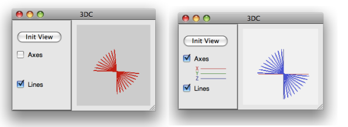
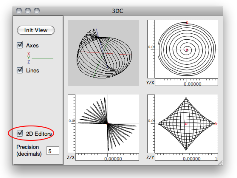
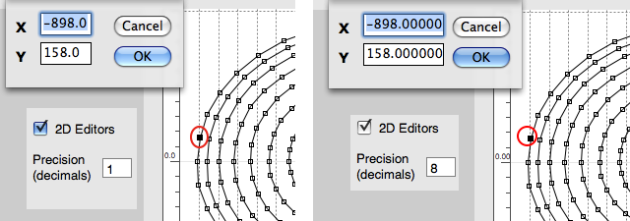

Navigation générale : 

  - [Guide](OM-Documentation.md)
  - [Plan](OM-Documentation_1.md)
  - [Glossaire](OM-Documentation_2.md)

OpenMusic
DocumentationHiérarchie
de section : [OM 6.6 User
Manual](OM-User-Manual.md) \>
[Basic Tools](BasicObjects.md)
\> [Curves and
Functions](CurvesAndFunctions.md) \>
[3D Objects](3D.md) \>
3DC

Navigation : [page
précédente](3D.md "page précédente(3D Objects)")
| [page
suivante](3DC-Lib.md "page suivante(3DC-Lib)")

**Attention**, votre navigateur ne supporte pas le **javascript** ou
celui-ci à été désactivé. Certaines fonctionnalités de ce guide sont
restreintes.

# 3D Curves

## The 3DC Object

|                                                                           |                                                                                                                                                         |
| ------------------------------------------------------------------------- | ------------------------------------------------------------------------------------------------------------------------------------------------------- |
|  | The **3DC** object is similar to a tridimensional BPC. The additional "**z-points**" slots allows the handling of the 3rd dimension of the coordinates. |

Access

To add a 3DC object, type its name or go to the`  Classes / Basic Tools
/ 3D menu `.

Inputs and Outputs

<table>
<colgroup>
<col style="width: 50%" />
<col style="width: 50%" />
</colgroup>
<tbody>
<tr class="odd">
<td>

The 3DC object has five inputs and outputs :

<ul>
<li>
"self" , which represents the object itself
</li>
<li>
"x-points", "y-points" and "z-points" : lists of x, y and z coordinates
</li>
<li>
"precision", the number of decimals for the coordinates.
</li>
</ul>

</td>
<td>

Generating a 3DC in OM using the x, y and z coordinates list.

</td>
</tr>
</tbody>
</table>

## 3D Visualization

<table>
<colgroup>
<col style="width: 50%" />
<col style="width: 50%" />
</colgroup>
<tbody>
<tr class="odd">
<td>

The 3DC editor allows to visualize the curve in a 3D view. It offers basic 3D navigation commands.

</td>
<td>

A 3DC and its editor.

</td>
</tr>
</tbody>
</table>

Displaying Axes and Colours

  - The `Axes` option allows to display the x , y , and z axes of the 3D
    object.

  - Press `b` or to change the background colour.

  - Press `c` to change the colour or the curve.

Manipulation of the Object

Click on the object and move the mouse to rotate the curve.

`SHIFT` + click and move up/down to zoom in/out

<table>
<colgroup>
<col style="width: 50%" />
<col style="width: 50%" />
</colgroup>
<tbody>
<tr class="odd">
<td>

Use <code class="textButton_tl">Init View</code> to restore the initial view point.

</td>
<td>

</td>
</tr>
</tbody>
</table>

Edition

The 3DC is only editable from the optional 2D views (see below).

## 2D Editors

To display the three 2D editors corresponding to projections of the
curves on the x/y, x/z and y/z planes, select the `2D Editors` option.
These editor are similar, and work exactly the same way as standard
[BPC editors](BPFEditors.md).

On single editor (the last clicked one) is active at a time, and will
then respond to key events for moving points, etc.

View and Edition

To zoom in/out on the 2D views the object, click and drag one of the
rulers. Use the button

of the palette to restore the original (optimal) view ratio.

Use the button

to navigate in a 2D view.

Note : When the `Precision` value is modified, the view is automatically
reset to its original ratio.

Use the stadard [BPC edit commands](Edition.md) to move or
delete points in the 2D editors.

Global Changes

Since any point belong to the three axes, it is displayed in **all
editors**. Consequently, any modification in an editor will affect the
two others, as well as the global 3D view.

Precision and Coordinates

To visualize the coordinates of a point, double click on it with the
mouse. These coordinates can be edited, just as in a BPC.

The `Precision` parameter changes the precision of the points with a
decimals number.

Precision changes may lead to modifying the points positions by
truncating their coordinates values.

Displaying Points or Curves

<table>
<colgroup>
<col style="width: 50%" />
<col style="width: 50%" />
</colgroup>
<tbody>
<tr class="odd">
<td>

As in standard BPF/BPC editors, the <code class="textCheckBox_tl">Lines</code> option allows to display the 3DC and 2D projections as points or as a continuous curve.

</td>
<td>

Displaying the points in a 3DC editor

</td>
</tr>
</tbody>
</table>

Références : 

Plan :

  - [OpenMusic Documentation](OM-Documentation.md)
  - [OM 6.6 User Manual](OM-User-Manual.md)
      - [Introduction](00-Sommaire.md)
      - [System Configuration and
        Installation](Installation.md)
      - [Going Through an OM Session](Goingthrough.md)
      - [The OM Environment](Environment.md)
      - [Visual Programming I](BasicVisualProgramming.md)
      - [Visual Programming
        II](AdvancedVisualProgramming.md)
      - [Basic Tools](BasicObjects.md)
          - [Curves and Functions](CurvesAndFunctions.md)
              - [BPF / BPC](BPF-BPC.md)
              - [BPF/BPC-Libs](MultiBPF.md)
              - [Editors](BPFEditors.md)
              - [BPF / BPC Tools](Tools.md)
              - [3D Objects](3D.md)
                  - 3DC
                  - [3DC-Lib](3DC-Lib.md)
          - [Array](ClassArray.md)
          - [TextFile](textfile.md)
          - [Picture](Picture.md)
      - [Score Objects](ScoreObjects.md)
      - [Maquettes](Maquettes.md)
      - [Sheet](Sheet.md)
      - [MIDI](MIDI.md)
      - [Audio](Audio.md)
      - [SDIF](SDIF.md)
      - [Lisp Programming](Lisp.md)
      - [Errors and Problems](errors.md)
  - [OpenMusic QuickStart](QuickStart-Chapters.md)

Navigation : [page
précédente](3D.md "page précédente(3D Objects)")
| [page
suivante](3DC-Lib.md "page suivante(3DC-Lib)")

[A propos...](OM-Documentation_3.md)(c) Ircam - Centre
Pompidou

