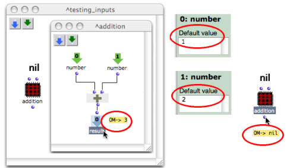

Navigation générale : 

  - [Guide](OM-Documentation.md)
  - [Plan](OM-Documentation_1.md)
  - [Glossaire](OM-Documentation_2.md)

OpenMusic
DocumentationHiérarchie
de section : [OM 6.6 User
Manual](OM-User-Manual.md) \>
[Visual Programming
II](AdvancedVisualProgramming.md) \>
[Abstraction](Abstraction.md)
\>
[Application](AbsApplication.md)
\> Input
Boxes

Navigation : [page
précédente](AbsInOuts.md "page précédente(Inputs / Outputs)")
| [page
suivante](Recursion.md "page suivante(Recursive Patches)")

**Attention**, votre navigateur ne supporte pas le **javascript** ou
celui-ci à été désactivé. Certaines fonctionnalités de ce guide sont
restreintes.

# Input Boxes

The inputs of an abstraction are represented inside the patch by green
boxes. When these boxes are assigned default values , the patch can be
evaluated internally and autonomously.

## Editing Inputs

<table>
<colgroup>
<col style="width: 50%" />
<col style="width: 50%" />
</colgroup>
<tbody>
<tr class="odd">
<td>

</td>
<td>

To edit the inputs of an abstraction, double click on an input box to open its editor.The editor displays :

<ul>
<li>the input name,</li>
<li>an editable <strong>"Documentation"</strong> frame,</li>
<li>an editable <strong>"Default Value"</strong> frame.</li>
</ul>

To edit information :

<ol>
<li>
enter values and / or a documentation,
</li>
<li>
choose <code class="textButton_tl">Apply</code>
</li>
<li>
close the input box once to validate the default values and documentation.
</li>
</ol>

</td>
</tr>
</tbody>
</table>

<table>
<colgroup>
<col style="width: 50%" />
<col style="width: 50%" />
</colgroup>
<tbody>
<tr class="odd">
<td>

To display the information :

<ol>
<li>
<code class="keyboard_tl">Ctrl</code> / right click on the patch and choose <code class="menuPath_tl">Update Doc</code>,
</li>
<li>
press <code class="keyboard_tl">Cmd</code> while hovering the mouse over the patch.
</li>
</ol>

</td>
<td>

</td>
</tr>
</tbody>
</table>

## Using Default Value

Default values allow to evaluate an internal patch from the inside .

Using an Instance as a Default Value

The **lower left** frame of the input editor can take an **instance** as
default input value.

To add an instance or a global variable there, drag an instance box from
a patch editor – or from the Globals package to this frame.

An instance can be created out of a factory box and dropped, as well as
a global variable, from a patch editor to an input editor.

Reminder

`SHIFT` + `Cmd` click on an outlet to create an instance in a patch
editor.

About Instances and Global Variables :

  - [Instance Boxes](InstanceBoxes.md)

## Internal Evaluation

Default values are designed to test if a patch works with an internal
evaluation.

To evaluate a patch internally, `Cmd` click on the internal output box.

Default values are ineffective as soon as a patch is evaluated from the
outside .

Note

<table>
<colgroup>
<col style="width: 50%" />
<col style="width: 50%" />
</colgroup>
<tbody>
<tr class="odd">
<td>

Default values are also ineffective if values are sent to the patch from other boxes.

</td>
<td>

</td>
</tr>
</tbody>
</table>

Références : 

Plan :

  - [OpenMusic Documentation](OM-Documentation.md)
  - [OM 6.6 User Manual](OM-User-Manual.md)
      - [Introduction](00-Sommaire.md)
      - [System Configuration and
        Installation](Installation.md)
      - [Going Through an OM Session](Goingthrough.md)
      - [The OM Environment](Environment.md)
      - [Visual Programming I](BasicVisualProgramming.md)
      - [Visual Programming
        II](AdvancedVisualProgramming.md)
          - [Abstraction](Abstraction.md)
              - [Abstraction Boxes](AbsBoxes.md)
              - [Application](AbsApplication.md)
                  - [Inputs / Outputs](AbsInOuts.md)
                  - Input
                    Boxes
              - [Recursive Patches](Recursion.md)
          - [Evaluation Modes](EvalModes.md)
          - [Higher-Order Functions](HighOrder.md)
          - [Control Structures](Control.md)
          - [Iterations: OMLoop](OMLoop.md)
          - [Instances](Instances.md)
          - [Interface Boxes](InterfaceBoxes.md)
          - [Files](Files.md)
      - [Basic Tools](BasicObjects.md)
      - [Score Objects](ScoreObjects.md)
      - [Maquettes](Maquettes.md)
      - [Sheet](Sheet.md)
      - [MIDI](MIDI.md)
      - [Audio](Audio.md)
      - [SDIF](SDIF.md)
      - [Lisp Programming](Lisp.md)
      - [Errors and Problems](errors.md)
  - [OpenMusic QuickStart](QuickStart-Chapters.md)

Navigation : [page
précédente](AbsInOuts.md "page précédente(Inputs / Outputs)")
| [page
suivante](Recursion.md "page suivante(Recursive Patches)")

[A propos...](OM-Documentation_3.md)(c) Ircam - Centre
Pompidou

