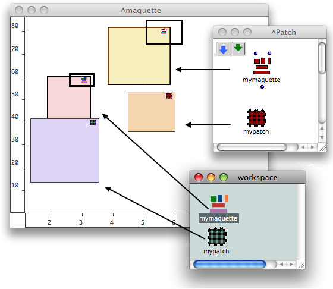

Navigation générale : 

  - [Guide](OM-Documentation.md)
  - [Plan](OM-Documentation_1.md)
  - [Glossaire](OM-Documentation_2.md)

OpenMusic
DocumentationHiérarchie
de section : [OM 6.6 User
Manual](OM-User-Manual.md) \>
[Maquettes](Maquettes.md) \>
[TemporalBoxes](TemporalBoxes.md)
\> Adding
TemporalBoxes

Navigation : [page
précédente](TemporalBoxes.md "page précédente(TemporalBoxes)")
| [page
suivante](elementary.md "page suivante(Elementary Manipulations)")

**Attention**, votre navigateur ne supporte pas le **javascript** ou
celui-ci à été désactivé. Certaines fonctionnalités de ce guide sont
restreintes.

# Adding TemporalBoxes in a Maquette

**Patches** and **other maquettes** can be included in maquettes, as
well as **instances** or **factory boxes** such as notes , chords ,
chord-seqs , voices , audio files , midifiles , MIDI controlers .

## Adding Boxes From a Patch

Instances

This maquette contains a patch, a factory box and an instance box.

Factory , instance boxes and global variables can be droppped from a
patch to a maquette editor.

When an object is dropped in the maquette, a TemporalBox appears in the
maquette. Its reference is the new factory or instance which is created
from the current value of the object.

Patches and Maquettes

**General and local** **patches or maquettes** can be dropped in a
maquette editor from the workspace or any other location. A reference to
the patch, or maquette, is then created.

  - If the master patch is a general patch
    
    , a reference to the patch is created.
  - If the master patch is a local patch
    ,
    a new independent reference patch is created.

Adding a maquette into another maquette allows the conception of
**temporal hierarchic structures** .

TemporalBoxes and Maquette Appearance

  - [Temporalboxes Appearance](Appearance.md)

TemporalBox Icon

To display the TemporalBox reference icon, select the `Show Box Icons`
option of the `Maquette Preferences` tab

## Adding Boxes Directly in the Maquette Editor

Local Patches and Maquettes

A **new local patch or maquette** can be added directly in a maquette.

  - To add a local patch, keep `Cmd` pressed while dragging the
    mouse in the maquette editor. 
  - To add a local maquette, keep `SHIFT` + `Cmd` pressed while
    dragging the mouse in the maquette editor. 

A TemporalBox of equivalent size and representing a new local patch or
maquette appear.

Adding Factory and Function Boxes

Factory and function boxes can't be added directly in a maquette editor.
They must be added in a patch located in the maquette.

Using Sub Patches in Maquettes

  - [TemporalBoxes Value](TempValues.md)

Adding and Deleting Boxes from the Outside of a Maquette

  - [Reference Mode](Maquettes%20in%20Patches2.md)

## Patch and "Temporal Patch"

<table>
<colgroup>
<col style="width: 50%" />
<col style="width: 50%" />
</colgroup>
<tbody>
<tr class="odd">
<td>

</td>
<td>

Patches located in maquettes can be refered to as " <strong>temporal patches</strong> ". Basically, temporal patches show no difference with "standard" patches :

<ul>
<li>they have the same editor</li>
<li> can access the same boxes and functionalities</li>
<li>they are manipulated the same way. </li>
</ul>

Nevertheless, temporal patches have an additional feature. They can be used within the context of the maquette via a specific input and output : the <strong>temporal input</strong> and <strong>temporal output</strong> .

</td>
</tr>
</tbody>
</table>

Temporal Input

The temporal input, or **Tempin** , allows to integrate the relation
between the TemporalBox and the maquette – size, position, for instance
– in the own program of the TemporalBox.

Temporal Output

The temporal output, or **Tempout** , allows to express the musical
value of a TemporalBox within the context of the maquette.

Références : 

Plan :

  - [OpenMusic Documentation](OM-Documentation.md)
  - [OM 6.6 User Manual](OM-User-Manual.md)
      - [Introduction](00-Sommaire.md)
      - [System Configuration and
        Installation](Installation.md)
      - [Going Through an OM Session](Goingthrough.md)
      - [The OM Environment](Environment.md)
      - [Visual Programming I](BasicVisualProgramming.md)
      - [Visual Programming
        II](AdvancedVisualProgramming.md)
      - [Basic Tools](BasicObjects.md)
      - [Score Objects](ScoreObjects.md)
      - [Maquettes](Maquettes.md)
          - [Creating a Maquette](Maquette.md)
          - [TemporalBoxes](TemporalBoxes.md)
              - Adding
                TemporalBoxes
              - [Elementary Manipulations](elementary.md)
              - [Temporalboxes Appearance](Appearance.md)
              - [TemporalBoxes Value](TempValues.md)
          - [The Maquette Editor](Editor.md)
          - [Maquette
            Programming](Programming%20Maquette.md)
          - [Maquettes in
            Patches](Maquettes%20in%20Patches.md)
      - [Sheet](Sheet.md)
      - [MIDI](MIDI.md)
      - [Audio](Audio.md)
      - [SDIF](SDIF.md)
      - [Lisp Programming](Lisp.md)
      - [Errors and Problems](errors.md)
  - [OpenMusic QuickStart](QuickStart-Chapters.md)

Navigation : [page
précédente](TemporalBoxes.md "page précédente(TemporalBoxes)")
| [page
suivante](elementary.md "page suivante(Elementary Manipulations)")

[A propos...](OM-Documentation_3.md)(c) Ircam - Centre
Pompidou

