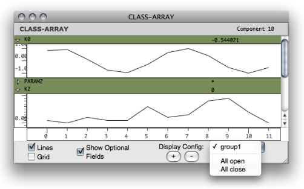

Navigation générale : 

  - [Guide](OM-Documentation.md)
  - [Plan](OM-Documentation_1.md)
  - [Glossaire](OM-Documentation_2.md)

OpenMusic
DocumentationHiérarchie
de section : [OM 6.6 User
Manual](OM-User-Manual.md) \>
[Basic Tools](BasicObjects.md)
\> [Array](ClassArray.md) \>
Class-Array
Editor

Navigation : [page
précédente](ArrayObject.md "page précédente(Class-Array Object)")
| [page
suivante](ArrayTools.md "page suivante(Class-Array Tools)")

**Attention**, votre navigateur ne supporte pas le **javascript** ou
celui-ci à été désactivé. Certaines fonctionnalités de ce guide sont
restreintes.

# Class-Array Editor

The **class-array ****** editor**** allows to visualize and edit – to a
certain extent – the contents of a class-array object.

## General Features

The class-array
editor.[Zoom](../res/array-ed_scr_1.png "Zoom (nouvelle fenêtre)")

In the class-array editor, rows are represented by a set of horizontal
panes.

These panes can be :

  -  **BPF -like views** , if the component values are numbers
    
  -  **list views** , if the components are other types of objects
    or values .

The following values can be displayed at the top of the editor by
hovering the mouse over a component :

  - the number of the current component 
  -  the values related to this component for each of the fields,
    such as coordinates, if values are available.

## Displaying Options and Configuration

Palette

<table>
<colgroup>
<col style="width: 50%" />
<col style="width: 50%" />
</colgroup>
<tbody>
<tr class="odd">
<td>

To zoom in/out on a selected region – a components subset – : use the  and  buttons of the palette.

</td>
<td>

</td>
</tr>
</tbody>
</table>

Options

<table>
<colgroup>
<col style="width: 50%" />
<col style="width: 50%" />
</colgroup>
<tbody>
<tr class="odd">
<td>

</td>
<td>

<ul>
<li>To display or hide the lines of BPFs, check the <code class="textCheckBox_tl">Line</code> option.</li>
<li>To apply a global grid to the editor, check the <code class="textCheckBox_tl">Grid</code> option.</li>
<li> To show or hide the user-defined field , check the <code class="textCheckBox_tl">Show Optional Fields</code> option. </li>
</ul>

All the fields of a simple class-array are user-defined. Consequently, all the rows of such arrays are hidden if this option is unchecked. Subclasses of class-arrays with "predefined" fields may remain visible.

</td>
</tr>
</tbody>
</table>

Rows Configuration

|                                                                                       |                                                                                                                   |
| ------------------------------------------------------------------------------------- | ----------------------------------------------------------------------------------------------------------------- |
|  | Each row can be hidden or shown with a click on the triangle icons located on the upper left corner of each pane. |

To save, recall or remove a given configuration, use the `+` and `-`
buttons at the bottom of the editor.

To select a configuration, use the adjacent `pop up menu`, which
contains all available or recorded configurations.

## Edition

BPF-Like Rows

**BPF -like rows** offer some of the possibilities of BPF editors :

  - hiding / showing lines
  - moving points, in order to change the value(s) of the
    corresponding components.

Points cannot me removed.

List Rows

**List rows** display the contents of every components, with various
types of representations depending on the type of data.

Objects with an editor – BPFs , score objects, arrays, etc.– can be open
by a double click and edited individually.

Limits of Array Editors

A big array may not represent all of its internal component values, in
which case the internal components display may be automatically
disabled.

Références : 

Plan :

  - [OpenMusic Documentation](OM-Documentation.md)
  - [OM 6.6 User Manual](OM-User-Manual.md)
      - [Introduction](00-Sommaire.md)
      - [System Configuration and
        Installation](Installation.md)
      - [Going Through an OM Session](Goingthrough.md)
      - [The OM Environment](Environment.md)
      - [Visual Programming I](BasicVisualProgramming.md)
      - [Visual Programming
        II](AdvancedVisualProgramming.md)
      - [Basic Tools](BasicObjects.md)
          - [Curves and Functions](CurvesAndFunctions.md)
          - [Array](ClassArray.md)
              - [Class-Array Object](ArrayObject.md)
              - Class-Array
                Editor
              - [Class-Array Tools](ArrayTools.md)
          - [TextFile](textfile.md)
          - [Picture](Picture.md)
      - [Score Objects](ScoreObjects.md)
      - [Maquettes](Maquettes.md)
      - [Sheet](Sheet.md)
      - [MIDI](MIDI.md)
      - [Audio](Audio.md)
      - [SDIF](SDIF.md)
      - [Lisp Programming](Lisp.md)
      - [Errors and Problems](errors.md)
  - [OpenMusic QuickStart](QuickStart-Chapters.md)

Navigation : [page
précédente](ArrayObject.md "page précédente(Class-Array Object)")
| [page
suivante](ArrayTools.md "page suivante(Class-Array Tools)")

[A propos...](OM-Documentation_3.md)(c) Ircam - Centre
Pompidou

