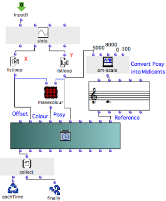

Navigation générale : 

  - [Guide](OM-Documentation.md)
  - [Plan](OM-Documentation_1.md)
  - [Glossaire](OM-Documentation_2.md)

OpenMusic
DocumentationHiérarchie
de section : [OM 6.6 User
Manual](OM-User-Manual.md) \>
[Maquettes](Maquettes.md) \>
[Maquettes in
Patches](Maquettes%20in%20Patches.md) \>
[Reference
Mode](Maquettes%20in%20Patches2.md) \>
Interation
(2)

Navigation : [page
précédente](REF5.md "page précédente(Interaction (1))")
| [page suivante](Sheet.md "page suivante(Sheet)")

**Attention**, votre navigateur ne supporte pas le **javascript** ou
celui-ci à été désactivé. Certaines fonctionnalités de ce guide sont
restreintes.

# TemporalBoxes Interaction : Examples (2)

## Determining Colour and Pitch From "Posy" and "Offset"

The " **posy** " of TemporalBoxes in the maquette can be applied to both
**pitches** and **colour** of the boxes. The graphic appearance of the
maquette may be more or less musically significant.

Program

<table>
<colgroup>
<col style="width: 50%" />
<col style="width: 50%" />
</colgroup>
<tbody>
<tr class="odd">
<td>

</td>
<td>

The position of the boxes is determined by a BPF. The same BPF is used for determining their pitch and colour. OMLoop iterates this operation to apply it to the a series of boxes located in a maquette.

<ol>
<li>
Boxes are added in the maquette when evaluating Addbox2maquette. Sequence and removealltemporalboxes "clean" the maquette at each evaluation, before new boxes are added.
</li>
<li>
OMLoop is returned the value of the points in the BPF. Coordinates allow to modify the TemporalBoxes colour on one hand, and their musical value on the other hand.
</li>
</ol>

</td>
</tr>
</tbody>
</table>

OMLoop

The "colour program" used in the [preceding
example](addexamples.md) is integrated in an internal patch.

1.  y-points are returned by listloop to om-scale successively : the
    pitch of a note object is defined.

2.  X and y-points are returned to the "make-colour" patch, to the
    "offset" and to the "posy" inputs of the temporalbox instance : the
    colour, offset and "posy" are defined.

3.  At each step of the loop, collect stores the value of a TemporalBox.

4.  At the end of the loop, a list of values is returned to
    addbox2maquette by finally.

<table>
<colgroup>
<col style="width: 50%" />
<col style="width: 50%" />
</colgroup>
<tbody>
<tr class="odd">
<td>

Inside the "make-colour" patch, x-points and y-points are converted into red and green values.

</td>
<td>

</td>
</tr>
</tbody>
</table>

Resulting Maquette

The result is visible after evaluating sequence. The corresponding
musical sequence can be visualized with a small program.

## Musical Sequence

Program

<table>
<colgroup>
<col style="width: 50%" />
<col style="width: 50%" />
</colgroup>
<tbody>
<tr class="odd">
<td>

</td>
<td>

Temporalboxes is connected to the output of the maquette. OMLoop returns the series of pitches produced by the TemporalBoxes to a chord-seq.

<ol>
<li>
Listloop returns the successive values of each TemporalBoxes to a corresponding slots box. This value is a note.
</li>
<li>
The "value" of slots is returned to car so that we get a list of notes. Otherwise, we would get a list of lists, which cannot produce a chord-seq, by convention.
</li>
<li>
Collect stores the successive notes values
</li>
<li>
Finally returns the resulting list of values.
</li>
</ol>

</td>
</tr>
</tbody>
</table>

Resulting Sequence

The evaluation of the chord-seq box in the patch yields the following
sequence :

Références : 

Plan :

  - [OpenMusic Documentation](OM-Documentation.md)
  - [OM 6.6 User Manual](OM-User-Manual.md)
      - [Introduction](00-Sommaire.md)
      - [System Configuration and
        Installation](Installation.md)
      - [Going Through an OM Session](Goingthrough.md)
      - [The OM Environment](Environment.md)
      - [Visual Programming I](BasicVisualProgramming.md)
      - [Visual Programming
        II](AdvancedVisualProgramming.md)
      - [Basic Tools](BasicObjects.md)
      - [Score Objects](ScoreObjects.md)
      - [Maquettes](Maquettes.md)
          - [Creating a Maquette](Maquette.md)
          - [TemporalBoxes](TemporalBoxes.md)
          - [The Maquette Editor](Editor.md)
          - [Maquette
            Programming](Programming%20Maquette.md)
          - [Maquettes in
            Patches](Maquettes%20in%20Patches.md)
              - [Build Mode](Build.md)
              - [Functional
                Mode](Maquettes%20in%20Patches1.md)
              - [Reference
                Mode](Maquettes%20in%20Patches2.md)
                  - [Adding TemporalBoxes](addprocedure.md)
                  - [Examples](addexamples.md)
                  - [Accessing Boxes](REF3.md)
                  - [Removing Boxes](REF4.md)
                  - [Interaction (1)](REF5.md)
                  - Interation
                    (2)
      - [Sheet](Sheet.md)
      - [MIDI](MIDI.md)
      - [Audio](Audio.md)
      - [SDIF](SDIF.md)
      - [Lisp Programming](Lisp.md)
      - [Errors and Problems](errors.md)
  - [OpenMusic QuickStart](QuickStart-Chapters.md)

Navigation : [page
précédente](REF5.md "page précédente(Interaction (1))")
| [page suivante](Sheet.md "page suivante(Sheet)")

[A propos...](OM-Documentation_3.md)(c) Ircam - Centre
Pompidou

