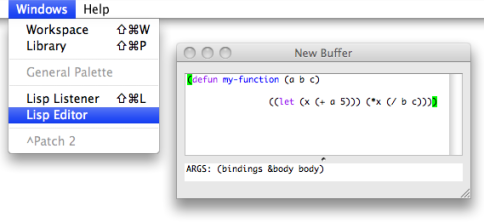
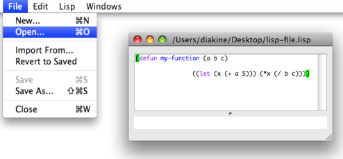

Navigation générale : 

  - [Guide](OM-Documentation.md)
  - [Plan](OM-Documentation_1.md)
  - [Glossaire](OM-Documentation_2.md)

OpenMusic
DocumentationHiérarchie
de section : [OM 6.6 User
Manual](OM-User-Manual.md) \>
[Lisp Programming](Lisp.md) \>
The Lisp
Editor

Navigation : [page
précédente](LispIntro.md "page précédente(Introduction to Lisp)")
| [page
suivante](LispListener.md "page suivante(The Listener)")

**Attention**, votre navigateur ne supporte pas le **javascript** ou
celui-ci à été désactivé. Certaines fonctionnalités de ce guide sont
restreintes.

# Writing/Evaluating Lisp Code : The Lisp Editor

The Lisp Editor allows to write Lisp code, or even a simple text. It
basically works as a standard text editor, providing all usual text
editing commands such as Cut/Copy/Paste, Open/Save/Save as,
Find/Replace...

## Lisp Buffers and Files

<table>
<colgroup>
<col style="width: 50%" />
<col style="width: 50%" />
</colgroup>
<tbody>
<tr class="odd">
<td>

<ul>
<li>
To open a Lisp editor window from a patch, choose <code class="menuPath_tl">Windows / Lisp Editor</code>.
</li>
<li>
To open another window from a current Lisp editor, choose <code class="menuPath_tl">File / New</code>.
</li>
</ul>

In both cases, the window is entitled "New Buffer".

</td>
<td>

</td>
</tr>
</tbody>
</table>

Lisp editors are text buffers, whose content may or not be attached or
saved in any file.

To save the content of the buffer, select `File / Save - Save As`,
choose a name and location in the dialogue window. The file name will
appear at the top of the window

  - To open an existing file **from a current buffer**, choose `File /
    Open` and select a text or lisp file.
    
    The buffer window will show the name of the file. the (that is,
    created with `File/Open`).

## Evaluation Commands

Main Commands

<table>
<colgroup>
<col style="width: 50%" />
<col style="width: 50%" />
</colgroup>
<tbody>
<tr class="odd">
<td>

<ul>
<li>
To evaluate one or several expression, select them and choose <code class="menuPath_tl">Lisp / Eval Region</code> or type <code class="keyboard_tl">Cmd</code> + <code class="keyboard_tl">e</code>.
</li>
<li>
To evaluate the whole buffer, use <code class="menuPath_tl">Lisp / Eval All</code> or type <code class="keyboard_tl">Cmd</code> + <code class="keyboard_tl">y</code>.
</li>
</ul>

The results from the evaluations of the different expressions will appear <strong>in the Listener</strong>.

</td>
<td>

<a href="../res/evalall_scr_1.png" class="caption_zm" title="Zoom (nouvelle fenêtre)">zoom</a>

</td>
</tr>
</tbody>
</table>

Alternative Procedure

<table>
<colgroup>
<col style="width: 50%" />
<col style="width: 50%" />
</colgroup>
<tbody>
<tr class="odd">
<td>

</td>
<td>

It is also possible to use internal Lisp buffer commands to evaluate expressions :

<ol>
<li>
put the cursor at the end of the expression to evaluate – that is, after the last closing parenthesis –
</li>
<li>
type <code class="keyboard_tl">Ctrl</code> + <code class="keyboard_tl">x</code> +<code class="keyboard_tl">e</code>.
</li>
</ol>

The result will appear in the lower text area of the window.

</td>
</tr>
</tbody>
</table>

Loading a Lisp File from the Listener

Lisp files can be loaded without opening them in the Lisp editor, using
the `Lisp / Load File` command menu in the Lisp Listener.

The Lisp Listener

  - [The Listener](LispListener.md)

## Finding Definitions and Information

Finding the definition of a given function or symbol may be useful when
programming. This is possible from the Lisp editor or the Listener.

In the editor window or in the Listener, put the cursor on a symbol and
use the `Lisp / Find Definition` menu or `Cmd` + `.` .

The Lisp Listener

  - [The Listener](LispListener.md)

When available, the file or text buffer containing the recorded
definition for this symbol will open in a new editor window.

In case of multiple definitions – for instance, several
meth[\[1\]](#kFootBsktc1873)ods[\[1\]](#kFootBsktc1873)
with the same name – select an item in the list with a double click.

[Zoom](../res/selectdefinition_scr_1.png "Zoom (nouvelle fenêtre)")

Arguments Information

<table>
<colgroup>
<col style="width: 50%" />
<col style="width: 50%" />
</colgroup>
<tbody>
<tr class="odd">
<td>

At typing a space after a function name in a Lisp editor, the arguments of the function will appear at the bottom of the window.

</td>
<td>

</td>
</tr>
</tbody>
</table>

Pay attention to the
package[\[2\]](#kFootBsktc4035)
of the function (and type it before the function name if necessary) or
the function arguments will not be displayed (and the function itself
will probably not be found at evaluation).

Références : 

1.  
    
    

    
    

    
    Method
    
    

    
    

    
    

    
    

    
    An elementary function or part of a generic function defining rules
    for its behaviour depending on a type of argument. Defining a
    generic function amounts to defining at least one method.
    
    For instance, the OM+ function is made of four methods : 1. number +
    list / 2. list + number / 3. number + number / 4. list + list
    
    

    
    

    
    

    
    

2.  
    
    

    
    

    
    Lisp Package
    
    

    
    

    
    

    
    

    
    In Lisp, a package is a means to gather symbols, such as functions,
    variables or class names, within a same specific name space. You are
    always working in a "current" package, which can be changed with the
    command (in-package "my-package").
    
    In orde to use items defined in other packages (unless these item's
    names are "exported" to the current package), it is generally
    necessary to type the package name (or "nickname"), separated by
    " : :", before the usual name ( Ex. : om : :om+ ).
    
    The default package in OM is "OPENMUSIC" or "OM". The default
    package in Common Lisp is "CL-USER".
    
    

    
    

    
    

    
    

Plan :

  - [OpenMusic Documentation](OM-Documentation.md)
  - [OM 6.6 User Manual](OM-User-Manual.md)
      - [Introduction](00-Sommaire.md)
      - [System Configuration and
        Installation](Installation.md)
      - [Going Through an OM Session](Goingthrough.md)
      - [The OM Environment](Environment.md)
      - [Visual Programming I](BasicVisualProgramming.md)
      - [Visual Programming
        II](AdvancedVisualProgramming.md)
      - [Basic Tools](BasicObjects.md)
      - [Score Objects](ScoreObjects.md)
      - [Maquettes](Maquettes.md)
      - [Sheet](Sheet.md)
      - [MIDI](MIDI.md)
      - [Audio](Audio.md)
      - [SDIF](SDIF.md)
      - [Lisp Programming](Lisp.md)
          - [Introduction to Lisp](LispIntro.md)
          - The Lisp
            Editor
          - [The Listener](LispListener.md)
          - [Lisp Code in OM](LispInOM.md)
          - [Lisp Function Boxes](LispFunctions.md)
          - [Lisp Tools](LowLevel.md)
          - [Writing an OM Library](LispUserLib.md)
          - [Writing Code for OM](LispForOM.md)
      - [Errors and Problems](errors.md)
  - [OpenMusic QuickStart](QuickStart-Chapters.md)

Navigation : [page
précédente](LispIntro.md "page précédente(Introduction to Lisp)")
| [page
suivante](LispListener.md "page suivante(The Listener)")

[A propos...](OM-Documentation_3.md)(c) Ircam - Centre
Pompidou

