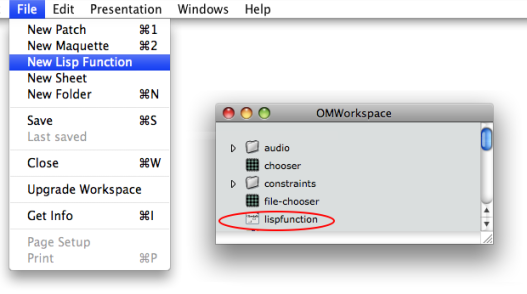
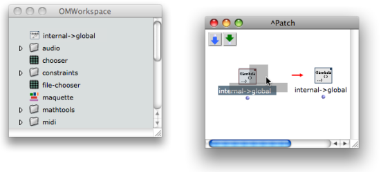
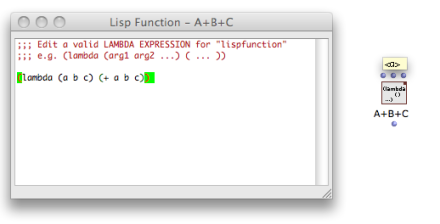

Navigation générale : 

  - [Guide](OM-Documentation.md)
  - [Plan](OM-Documentation_1.md)
  - [Glossaire](OM-Documentation_2.md)

OpenMusic
DocumentationHiérarchie
de section : [OM 6.6 User
Manual](OM-User-Manual.md) \>
[Lisp Programming](Lisp.md) \>
Lisp Function
Boxes

Navigation : [page
précédente](LispInOM.md "page précédente(Lisp Code in OM)")
| [page
suivante](LowLevel.md "page suivante(Lisp Tools)")

**Attention**, votre navigateur ne supporte pas le **javascript** ou
celui-ci à été désactivé. Certaines fonctionnalités de ce guide sont
restreintes.

# Lisp Function Boxes

Writing a function or procedure in Lisp can be more convenient that the
creation of a visual program. **Lisp Function boxes** are abstractions
defined in Lisp textually. Like visual abstractions

  - they can be internal to a patch
    
    – red

  - or defined globally in the environment and workspace 
    –blue.

## Creating Lisp Functions

Internal Lisp Function (Red)

<table>
<colgroup>
<col style="width: 50%" />
<col style="width: 50%" />
</colgroup>
<tbody>
<tr class="odd">
<td>

</td>
<td>

To create a new Lisp function in a patch you can either

<ul>
<li>
use the contextual menu <code class="menuPath_tl">Internal / Lisp Function</code> in the patch editor
</li>
<li>
or <code class="keyboard_tl">Cmd</code> click and type "lisp".
</li>
</ul>

A new box will appear, with one output. It doesn't have a default input. This box behaves externally as a red patch box — internal abstraction —.

</td>
</tr>
</tbody>
</table>

Internal Abstractions

  - [Internal Abstractions](RedAbstraction.md)

Global Lisp Function (Blue)

To create a **global Lisp Function** like a patch or a maquette, use the
`File / New Function` menu item in the workspace or folder windows.

The new Lisp function created here can be used in several locations,
just like a blue patch. All its representations will refer to this same
master function.

The box created will (externally) behave as a blue patch box.

Global Abstraction

  - [Standard Abstraction](BlueAbstraction.md)

Lisp Functions Conversion

Red and blue Lisp functions can also be converted with the standard
patch conversion procedures.

To globalize a red lisp function, drag it to the workspace. The function
will be converted automatically.

To rename the function, rename it from the workspace.

<table>
<colgroup>
<col style="width: 50%" />
<col style="width: 50%" />
</colgroup>
<tbody>
<tr class="odd">
<td>

To internalize a blue lisp function, select it and press <code class="keyboard_tl">a</code>. It can then be copied and renamed freely in the patch.

</td>
<td>

</td>
</tr>
</tbody>
</table>

Converting Internal/Global Abstractions

  - [Conversions](AbsConversion.md)

## Editing Lisp Functions

Lisp Function Editor

Double click a Lisp Function box to edit its contents. The window that
opens is similar to a Lisp editor.

The Lisp Editor

  - [Writing/Evaluating Lisp Code : The Lisp
    Editor](LispEditor.md)

Writing Lisp Functions

<table>
<colgroup>
<col style="width: 50%" />
<col style="width: 50%" />
</colgroup>
<tbody>
<tr class="odd">
<td>

The function must be written as a <strong>lambda expression</strong> with a given number of arguments. The editor provides a default basic edition pattern showing the components of such lambda expression.

</td>
<td>

</td>
</tr>
</tbody>
</table>

What is a Lambda Expression ?

  - [Introduction to Lisp](LispIntro.md)

Arguments and Inputs

When the Lisp editor of the box is closed, the number of inputs is
updated according to the number of arguments of the function, if
arguments have been added or deleted.

Unique Output

Lisp functions can have only one output, which corresponds to the value
returned by the Lambda expression.

Références : 

Plan :

  - [OpenMusic Documentation](OM-Documentation.md)
  - [OM 6.6 User Manual](OM-User-Manual.md)
      - [Introduction](00-Sommaire.md)
      - [System Configuration and
        Installation](Installation.md)
      - [Going Through an OM Session](Goingthrough.md)
      - [The OM Environment](Environment.md)
      - [Visual Programming I](BasicVisualProgramming.md)
      - [Visual Programming
        II](AdvancedVisualProgramming.md)
      - [Basic Tools](BasicObjects.md)
      - [Score Objects](ScoreObjects.md)
      - [Maquettes](Maquettes.md)
      - [Sheet](Sheet.md)
      - [MIDI](MIDI.md)
      - [Audio](Audio.md)
      - [SDIF](SDIF.md)
      - [Lisp Programming](Lisp.md)
          - [Introduction to Lisp](LispIntro.md)
          - [The Lisp Editor](LispEditor.md)
          - [The Listener](LispListener.md)
          - [Lisp Code in OM](LispInOM.md)
          - Lisp Function
            Boxes
          - [Lisp Tools](LowLevel.md)
          - [Writing an OM Library](LispUserLib.md)
          - [Writing Code for OM](LispForOM.md)
      - [Errors and Problems](errors.md)
  - [OpenMusic QuickStart](QuickStart-Chapters.md)

Navigation : [page
précédente](LispInOM.md "page précédente(Lisp Code in OM)")
| [page
suivante](LowLevel.md "page suivante(Lisp Tools)")

[A propos...](OM-Documentation_3.md)(c) Ircam - Centre
Pompidou

