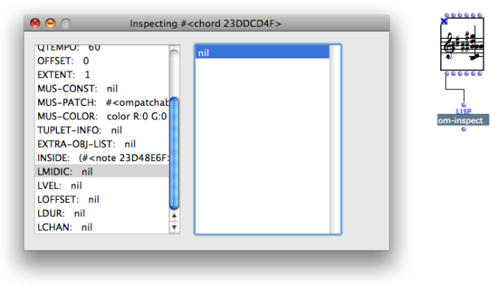
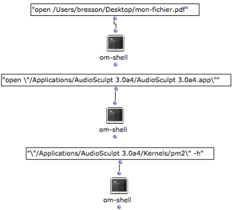

Navigation générale : 

  - [Guide](OM-Documentation.md)
  - [Plan](OM-Documentation_1.md)
  - [Glossaire](OM-Documentation_2.md)

OpenMusic
DocumentationHiérarchie
de section : [OM 6.6 User
Manual](OM-User-Manual.md) \>
[Lisp Programming](Lisp.md) \>
Lisp Tools

Navigation : [page
précédente](LispFunctions.md "page précédente(Lisp Function Boxes)")
| [page
suivante](LispUserLib.md "page suivante(Writing an OM Library)")

**Attention**, votre navigateur ne supporte pas le **javascript** ou
celui-ci à été désactivé. Certaines fonctionnalités de ce guide sont
restreintes.

# Lisp Tools

Several underlying Lisp functionalities are available from the OM
patches, as show the few examples presented below.

## The Object Inspector : Om-Inspect

Properties

|                                                                                       |                                                                                                                                                                                                                               |
| ------------------------------------------------------------------------------------- | ----------------------------------------------------------------------------------------------------------------------------------------------------------------------------------------------------------------------------- |
|  | The **om-inspect** function allows an **interactive inspection** of the contents of a data structure. All slots or elements of the structure can be browsed and inspected recursively, via a a simple list display interface. |

Browsing an Object

To browse the structure of the object, connect the "self" output of the
object to the "object" input of the function.

To get information about the current value of an specific slot, connect
the relevant output to the function.

## System Calls : Om-Shell

Properties

The **om-shell** function sends **system calls** to the Unix Terminal —
MacOSX — or to the Win32 Console — Windows. It is a useful and easy way
to run external programs from OM.

Example \#1 : Browsing a Folder

The "ls" command in Unix allows to list the contents of a directory. The
command "ls " + pathname to the folder will be display this list in the
Listener.

Examples \#2 : Launching an Application or a File

An application of a file can be launched via the "open ", "open \\"
commands, or with a a command line.

Références : 

Plan :

  - [OpenMusic Documentation](OM-Documentation.md)
  - [OM 6.6 User Manual](OM-User-Manual.md)
      - [Introduction](00-Sommaire.md)
      - [System Configuration and
        Installation](Installation.md)
      - [Going Through an OM Session](Goingthrough.md)
      - [The OM Environment](Environment.md)
      - [Visual Programming I](BasicVisualProgramming.md)
      - [Visual Programming
        II](AdvancedVisualProgramming.md)
      - [Basic Tools](BasicObjects.md)
      - [Score Objects](ScoreObjects.md)
      - [Maquettes](Maquettes.md)
      - [Sheet](Sheet.md)
      - [MIDI](MIDI.md)
      - [Audio](Audio.md)
      - [SDIF](SDIF.md)
      - [Lisp Programming](Lisp.md)
          - [Introduction to Lisp](LispIntro.md)
          - [The Lisp Editor](LispEditor.md)
          - [The Listener](LispListener.md)
          - [Lisp Code in OM](LispInOM.md)
          - [Lisp Function Boxes](LispFunctions.md)
          - Lisp
            Tools
          - [Writing an OM Library](LispUserLib.md)
          - [Writing Code for OM](LispForOM.md)
      - [Errors and Problems](errors.md)
  - [OpenMusic QuickStart](QuickStart-Chapters.md)

Navigation : [page
précédente](LispFunctions.md "page précédente(Lisp Function Boxes)")
| [page
suivante](LispUserLib.md "page suivante(Writing an OM Library)")

[A propos...](OM-Documentation_3.md)(c) Ircam - Centre
Pompidou

