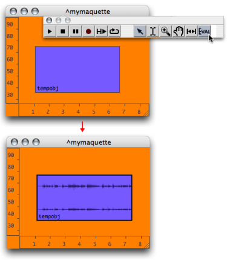

Navigation générale : 

  - [Guide](OM-Documentation.md)
  - [Plan](OM-Documentation_1.md)
  - [Glossaire](OM-Documentation_2.md)

OpenMusic
DocumentationHiérarchie
de section : [OM 6.6 User
Manual](OM-User-Manual.md) \>
[Maquettes](Maquettes.md) \>
[Maquette
Programming](Programming%20Maquette.md) \>
Evaluation

Navigation : [page
précédente](InputsOutputs.md "page précédente(Functional Components)")
| [page
suivante](Synthpatchprog.md "page suivante(The Synthesis Patch)")

**Attention**, votre navigateur ne supporte pas le **javascript** ou
celui-ci à été désactivé. Certaines fonctionnalités de ce guide sont
restreintes.

# Evaluation of the Maquette

## Evaluation Procedures

Global Evaluation of the Maquette

To evaluate a whole maquette, select `Eval` in the palette. OM evaluates
**all the boxes** located at the end of the programming chain, which
will eventually lead to the evaluation of all the TemporalBoxes of the
maquette.

The global evaluation of the maquette returns a **maquetteobj** . The
listener displays a message of the type " =\> \#".

Note that this command applies to the whole maquette even if a specific
TemporalBox is selected.

Associated Files

In some cases, OM asks to choose a file when the box is evaluated, event
if it was already attributed a file. This is the case when a TemporalBox
refers to a sound file, for instance.

**Boxes can be locked** to avoid the systematic opening of the dialogue
window.

Evaluating TemporalBoxes

Choose a TemporalBox and press `v`. The selected box and **all other
connected boxes** are be evaluated.

Controlling TemporalBoxes Evaluation

TemporalBoxes can be set on "[lock](LockMode.md)" or
"[evaluate-once](EvOnceMode.md)" mode, so as their content
is protected, or to limit the number of internal evaluations.

## Default Calculation of a Maquette's Value

The value of a maquette is the musical object, or container, yielded
when the maquette is evaluated. Very basically, this musical object is
actually what is played by the player, just as with a sequencer.

<table>
<colgroup>
<col style="width: 50%" />
<col style="width: 50%" />
</colgroup>
<tbody>
<tr class="odd">
<td>

The default type of this object is a <strong>maquetteobj</strong> : a musical sequence, a whole that combines TemporalBoxes, with a given musical value and temporal position.

This is especially visible when a local maquette is evaluated from a patch : the Listener displays a "maquetteobj" reference. It can be compared with the object connected to a Tempout.

</td>
<td>

</td>
</tr>
</tbody>
</table>

Synthesis Patches

Maquettes can represent many other types of objects : sounds, chords,
melodic sequences... The way a maquette is calculated can also be
modified, so that the values of its TemporalBoxes is interpreted
differently. To do so, a **synthesis patch** can be integrated in the
maquette, like an " **output evaluation tool** ".

About Synthesis Patches

  - [Calculating the Value of a
    Maquette](Synthesispatch.md)

Références : 

Plan :

  - [OpenMusic Documentation](OM-Documentation.md)
  - [OM 6.6 User Manual](OM-User-Manual.md)
      - [Introduction](00-Sommaire.md)
      - [System Configuration and
        Installation](Installation.md)
      - [Going Through an OM Session](Goingthrough.md)
      - [The OM Environment](Environment.md)
      - [Visual Programming I](BasicVisualProgramming.md)
      - [Visual Programming
        II](AdvancedVisualProgramming.md)
      - [Basic Tools](BasicObjects.md)
      - [Score Objects](ScoreObjects.md)
      - [Maquettes](Maquettes.md)
          - [Creating a Maquette](Maquette.md)
          - [TemporalBoxes](TemporalBoxes.md)
          - [The Maquette Editor](Editor.md)
          - [Maquette
            Programming](Programming%20Maquette.md)
              - [Functional Components](InputsOutputs.md)
              - Evaluation
              - [The Synthesis Patch](Synthpatchprog.md)
              - [TempBoxes Programming](TempProgramming.md)
          - [Maquettes in
            Patches](Maquettes%20in%20Patches.md)
      - [Sheet](Sheet.md)
      - [MIDI](MIDI.md)
      - [Audio](Audio.md)
      - [SDIF](SDIF.md)
      - [Lisp Programming](Lisp.md)
      - [Errors and Problems](errors.md)
  - [OpenMusic QuickStart](QuickStart-Chapters.md)

Navigation : [page
précédente](InputsOutputs.md "page précédente(Functional Components)")
| [page
suivante](Synthpatchprog.md "page suivante(The Synthesis Patch)")

[A propos...](OM-Documentation_3.md)(c) Ircam - Centre
Pompidou

