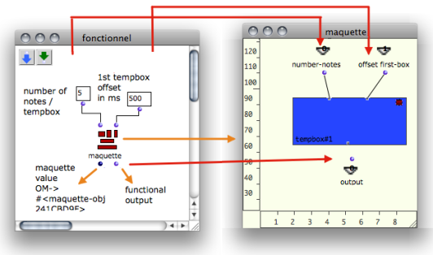
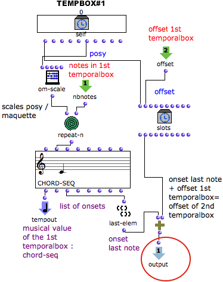
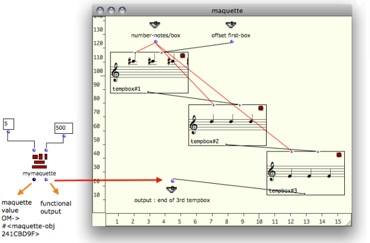

Navigation générale : 

  - [Guide](OM-Documentation.md)
  - [Plan](OM-Documentation_1.md)
  - [Glossaire](OM-Documentation_2.md)

OpenMusic
DocumentationHiérarchie
de section : [OM 6.6 User
Manual](OM-User-Manual.md) \>
[Maquettes](Maquettes.md) \>
[Maquettes in
Patches](Maquettes%20in%20Patches.md) \>
Functional
Mode

Navigation : [page
précédente](Build.md "page précédente(Build Mode)")
| [page
suivante](Maquettes%20in%20Patches2.md "page suivante(Reference Mode)")

**Attention**, votre navigateur ne supporte pas le **javascript** ou
celui-ci à été désactivé. Certaines fonctionnalités de ce guide sont
restreintes.

# Functional Mode

## Use

A maquette on "functional" mode can be compared to a function. This is
especially significant when a maquette is to receive or to return
values, from the inside of a patch or another maquette.

Procedure

<table>
<colgroup>
<col style="width: 50%" />
<col style="width: 50%" />
</colgroup>
<tbody>
<tr class="odd">
<td>

When a maquette is added in a patch, it is by default on "build" mode, as show its dark blue inputs and outputs.

To set a maquette box on "functional" mode, <code class="keyboard_tl">Ctrl</code> / right click on the maquette box and select <code class="menuPath_tl">Functional Inputs</code>.

</td>
<td>

</td>
</tr>
</tbody>
</table>

<table>
<colgroup>
<col style="width: 50%" />
<col style="width: 50%" />
</colgroup>
<tbody>
<tr class="odd">
<td>

</td>
<td>

The maquette then shows only one "build" output. "Build" inputs disappear.

When inputs and outputs are added from the maquette editor, they appear on the outside of the maquette as standard inputs and outputs. The "value" output remains visible in first position.

</td>
</tr>
</tbody>
</table>

Functionalities

<table>
<tbody>
<tr class="odd">
<td>

</td>
<td>
Functional inputs allow

<ul>
<li> to pass values from the patch to the maquette</li>
<li> possibly to get outcoming values back. </li>
</ul></td>
</tr>
</tbody>
</table>

The content of the maquette is not built from the patch, but used as a
preexistent full-fledged function.

## Example : Defining a Sequence from the Outside and Inside of the Maquette

In this example,a maquette is used inside a patch for building a
sequence with three TemporalBoxes.

Organizing the Maquette

On one hand, a number of notes and an initial offset are defined **from
the outside of the maquette** .

On the other hand

  - pitches are determined by the **vertical position of each
    box** 
  - the successive offsets of the second and third box are
    calculated from **inside the maquette** .

  - The **first functional input** of the maquette is assigned a
    **number of notes** and connected to the first input of a
    TemporalBox.
  - The **second functional input** is assigned an offset –
    starting point in milliseconds – and connected to the second input
    of the TemporalBox.
  - The output of the maquette can possibly send data **from the
    TemporalBox** to the **outside** of the maquette.

Programming TemporalBox \#1

Values are returned to the functional inputs of the maquette to define a
chord-seq in the TemporalBox.

  - The "posy" is scaled from 5000 to 8000 by om-scale.
  - The resulting pitch is repeated five times by repeat-n and
    returned to the chord-seq.
  - The chord-seq box is connected to the Tempout : it is now the
    musical value of the TemporalBox.
  - The offset of the TemporalBox is added to the onset of the
    chord-seq's last note, and returned to the functional output. This
    determines the position of the next box in the maquette.

Defining TemporalBoxes \#2 and 3 and Evaluating the
Maquette

TemporalBox \#1 is duplicated to create two new TemporalBoxes, which are
connected to each other and to the maquette inputs.

Completing the sequence

1.  The same number of notes is returned by the first input of the
    maquette to all TemporalBoxes.

2.  The ending offset value  of a TemporalBox is connected to the second
    input of the next TemporalBox. Boxes follow each other in a temporal
    sequence.

3.  Pitches match the vertical position of the boxes.

4.  The ending offset calculated in TemporalBox \#3 is returned to the
    **functional output** of the maquette. It can possibly be used for
    subsequent computations in the patch editor, or in another maquette.

Références : 

Plan :

  - [OpenMusic Documentation](OM-Documentation.md)
  - [OM 6.6 User Manual](OM-User-Manual.md)
      - [Introduction](00-Sommaire.md)
      - [System Configuration and
        Installation](Installation.md)
      - [Going Through an OM Session](Goingthrough.md)
      - [The OM Environment](Environment.md)
      - [Visual Programming I](BasicVisualProgramming.md)
      - [Visual Programming
        II](AdvancedVisualProgramming.md)
      - [Basic Tools](BasicObjects.md)
      - [Score Objects](ScoreObjects.md)
      - [Maquettes](Maquettes.md)
          - [Creating a Maquette](Maquette.md)
          - [TemporalBoxes](TemporalBoxes.md)
          - [The Maquette Editor](Editor.md)
          - [Maquette
            Programming](Programming%20Maquette.md)
          - [Maquettes in
            Patches](Maquettes%20in%20Patches.md)
              - [Build Mode](Build.md)
              - Functional
                Mode
              - [Reference
                Mode](Maquettes%20in%20Patches2.md)
      - [Sheet](Sheet.md)
      - [MIDI](MIDI.md)
      - [Audio](Audio.md)
      - [SDIF](SDIF.md)
      - [Lisp Programming](Lisp.md)
      - [Errors and Problems](errors.md)
  - [OpenMusic QuickStart](QuickStart-Chapters.md)

Navigation : [page
précédente](Build.md "page précédente(Build Mode)")
| [page
suivante](Maquettes%20in%20Patches2.md "page suivante(Reference Mode)")

[A propos...](OM-Documentation_3.md)(c) Ircam - Centre
Pompidou

