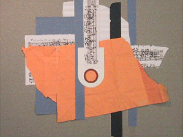

Navigation générale : 

  - Guide
  - [Plan](OM-Documentation_1.md)
  - [Glossaire](OM-Documentation_2.md)

OpenMusic
Documentation

Navigation :  |
[page
suivante](OM-User-Manual.md "page suivante(OM 6.6 User Manual)")

**Attention**, votre navigateur ne supporte pas le **javascript** ou
celui-ci à été désactivé. Certaines fonctionnalités de ce guide sont
restreintes.

|  |                                                                                                                        |  |
|  | ---------------------------------------------------------------------------------------------------------------------- |  |
|  | [  ](00-Sommaire.md) |  |

OpenMusic (OM) is a visual programming language designed for music
composition. Visual programs (called "patches") can be created by
connecting graphical modules together, corresponding to musical objects
or data processing functions.

OM offers you a complete freedom in programming, including text
programming via the Common Lisp language. A large numbers of specialized
projects and libraries are available for specific applications
(mathematical tools, sound processing and synthesis, etc.)

This documentation is divided in two main parts :

  - **A complete user manual** describing the use and features of
    the evironment
  - **A "quickstart" tutorial** with video demonstrations

OM Libraries

Note that many tools available in OpenMusic are part of separate
libraries, which are not documented in this manual.

Références : 

Plan :

  - OpenMusic
    Documentation
  - [OM 6.6 User Manual](OM-User-Manual.md)
  - [OpenMusic QuickStart](QuickStart-Chapters.md)

Navigation :  |
[page
suivante](OM-User-Manual.md "page suivante(OM 6.6 User Manual)")

[A propos...](OM-Documentation_3.md)(c) Ircam - Centre
Pompidou

