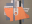

Navigation générale : 

  - [Guide](OM-Documentation.html)
  - [Plan](OM-Documentation_1.html)
  - [Glossaire](OM-Documentation_2.html)

OpenMusic
Documentation

Navigation : [page
précédente](OM-Documentation.html "page précédente(OpenMusic Documentation)")
| [page
suivante](00-Sommaire.html "page suivante(Introduction)")

**Attention**, votre navigateur ne supporte pas le **javascript** ou
celui-ci à été désactivé. Certaines fonctionnalités de ce guide sont
restreintes.

# OM 6.6 User Manual

[ ](00-Sommaire.html) **** [ ********
](00-Sommaire.html)This document is the kernel of the OpenMusic
Software documentation. It is composed of the following sections :

[****Introduction**** ](00-Sommaire.html) ****

Basic concepts, entries to the user manual, additional information and
publications.

[****Chapter 1 : System Configuration and Installation****
](Installation.html) ****

Available versions for Mac and Windows OS. Installation procedures for
Mac OSX.

[****Chapter 2 : Going Through an OM Session****
](Goingthrough.html) ****

Practical information and a few concepts to manage each step of a
session.

[****Chapter 3 : The OM Environment**** ](Environment.html)
****

Main features and general settings of the OM environment, as well as
managing documents and functionalities of the main windows.

[****Chapter 4 : Visual Programming I (Basics)****
](BasicVisualProgramming.html) ****

This section provides all information about visual programming tools and
basic programming concepts.

[**Chapter 5 : Visual Programming II
(Advanced)**](AdvancedVisualProgramming.html)

Advanced programming concepts, including functional abstraction, control
of computation and iterative programs.

[****Chapter** 6 : OM Basic Tools**](BasicObjects.html)
****

Using and manipulating basic objects, such as curves, arrays, text, etc.

[****Chapter** 7 : Score Objects**](BasicObjects.html) ****

Using and manipulating score objects such as chords, rhythms,
polyphonies and so on.

[****Chapter** 8 : Maquettes**](Maquettes.html) ****

Designing musical sequences and using the graphic and temporal
dimensions of maquettes to define specific interactions within programs.

[****Chapter** 9 : Sheet**](Sheet.html) ****

The Sheet is a special polyphonic container allowing to collect
different types of musical objects in a common score and to program
genrative rules and relations withing this score.

[****Chapter 10 : MIDI**** ](MIDI.html) ****

All about MIDI features and objects in OM

[****Chapter 11 :** **Audio**** ](Audio.html) ****

All about audio features and objects in OM

[****Chapter 12 :** **SDIF**** ](SDIF.html) ****

Using (and understanding) the SDIF sound description data in OM.

[****Chater 13 :** **Lis**p Programming in OM**](Lisp.html)
****

How to program in Lisp and integrate Lisp code in the OM environment.

[****Errors and Problems**** ](errors.html) ****

Understanding and handling error messages.

Références : 

Plan :

  - [OpenMusic Documentation](OM-Documentation.html)
  - OM 6.6 User
    Manual
      - [Introduction](00-Sommaire.html)
      - [System Configuration and
        Installation](Installation.html)
      - [Going Through an OM Session](Goingthrough.html)
      - [The OM Environment](Environment.html)
      - [Visual Programming I](BasicVisualProgramming.html)
      - [Visual Programming
        II](AdvancedVisualProgramming.html)
      - [Basic Tools](BasicObjects.html)
      - [Score Objects](ScoreObjects.html)
      - [Maquettes](Maquettes.html)
      - [Sheet](Sheet.html)
      - [MIDI](MIDI.html)
      - [Audio](Audio.html)
      - [SDIF](SDIF.html)
      - [Lisp Programming](Lisp.html)
      - [Errors and Problems](errors.html)
  - [OpenMusic QuickStart](QuickStart-Chapters.html)

Navigation : [page
précédente](OM-Documentation.html "page précédente(OpenMusic Documentation)")
| [page
suivante](00-Sommaire.html "page suivante(Introduction)")

[A propos...](OM-Documentation_3.html)(c) Ircam - Centre
Pompidou

