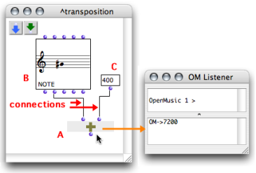

Navigation générale : 

  - [Guide](OM-Documentation.md)
  - [Plan](OM-Documentation_1.md)
  - [Glossaire](OM-Documentation_2.md)

OpenMusic
DocumentationHiérarchie
de section : [OM 6.6 User
Manual](OM-User-Manual.md) \>
[Visual Programming
I](BasicVisualProgramming.md) \>
Patch
Introduction

Navigation : [page
précédente](BasicVisualProgramming.md "page précédente(Visual Programming I)")
| [page
suivante](AddingBoxes.md "page suivante(Adding Boxes Into a Patch)")

**Attention**, votre navigateur ne supporte pas le **javascript** ou
celui-ci à été désactivé. Certaines fonctionnalités de ce guide sont
restreintes.

# Introduction to Patch Programming

Almost all programming in OpenMusic is done in patches, which are visual
representations of programs.

## Location

Patches are created in the
workspace[\[1\]](#kFootBsktc1849)
window.

More Information about Patches and Other Documents :

  - [Workspace](Workspace.md)

Most visual programming is done in the **patch** **editor** , which
opens by a double click on the patch icon.

## Content

Patches contain **boxes,** which represent :

  -  **functions** that are called or used by the program, 
  -  **objects** – such as notes, sound files and so on –, that
    are created and processed in the program.

**Connections** link these components together to define the functional
structure of the program.

Boxes and Programs

The various box types that might interact in a program generally have
different properties. Each box type is described in the [Boxes and
Patch Components](Boxes.md) section. You will also learn how to
create patches within other patches. This very convenient procedure is
called  [functional abstraction](Abstraction.md). The user
will resort to it as soon as he or she gets familiar with OM.

A Simple Patch Example : Performing a Transposition

This patch contains three items :

  - A : the **** ****om+** **function**** **** , which executes
    additions
  - B : a **note** object
  - C : a **data box** . 

The note is a G\#4, which means its pitch is equal to 6800
midicents[\[2\]](#kFootBsktc2000).
This pitch can be accessed via the second inlet and outlet of the box.

The first input of om+ is connected to the second outlet of the note :
the pitch of the note is the first term of the addition.

The data box represents a value : 400. It is connected to the second
inlet of om+. It is the second term of the addition.

When om+ is evaluated, the Listener displays the value of the resulting
pitch in midicents.

Références : 

1.  
    
    

    
    

    
    Workspace
    
    

    
    

    
    

    
    

    
    OpenMusic's working environment. Each session starts with choosing a
    workspace, the equivalent of a desktop where programs are created
    and organized, and where items can be stored.
    
    

    
    

    
    

    
    

2.  
    
    

    
    

    
    Midicent
    
    

    
    

    
    

    
    

    
    A midicent is a unit representing one cent of the usual MIDI pitch
    unit, that is, a half-tone. For instance, a C4 corresponds to 60 in
    MIDI, and to 6000 midicents, C4\# to 61, i.e. 6100 midicents, and so
    on.
    
    

    
    

    
    

    
    

Plan :

  - [OpenMusic Documentation](OM-Documentation.md)
  - [OM 6.6 User Manual](OM-User-Manual.md)
      - [Introduction](00-Sommaire.md)
      - [System Configuration and
        Installation](Installation.md)
      - [Going Through an OM Session](Goingthrough.md)
      - [The OM Environment](Environment.md)
      - [Visual Programming I](BasicVisualProgramming.md)
          - Patch
            Introduction
          - [Adding Boxes Into a Patch](AddingBoxes.md)
          - [Elementary Manipulations](ElementaryManips.md)
          - [Boxes](Boxes.md)
          - [Box Inputs](BoxInputs.md)
          - [Connections](Connections.md)
          - [Evaluation](Evaluation.md)
          - [Documentation and Info](DocAndInfo.md)
          - [Comments](Comments.md)
          - [Pictures](Pictures.md)
          - [Saving / Reloading a Patch](SavingPatch.md)
          - [Dead Boxes](DeadBox.md)
      - [Visual Programming
        II](AdvancedVisualProgramming.md)
      - [Basic Tools](BasicObjects.md)
      - [Score Objects](ScoreObjects.md)
      - [Maquettes](Maquettes.md)
      - [Sheet](Sheet.md)
      - [MIDI](MIDI.md)
      - [Audio](Audio.md)
      - [SDIF](SDIF.md)
      - [Lisp Programming](Lisp.md)
      - [Errors and Problems](errors.md)
  - [OpenMusic QuickStart](QuickStart-Chapters.md)

Navigation : [page
précédente](BasicVisualProgramming.md "page précédente(Visual Programming I)")
| [page
suivante](AddingBoxes.md "page suivante(Adding Boxes Into a Patch)")

[A propos...](OM-Documentation_3.md)(c) Ircam - Centre
Pompidou

