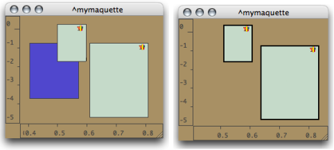
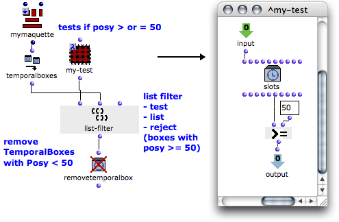

Navigation générale : 

  - [Guide](OM-Documentation.md)
  - [Plan](OM-Documentation_1.md)
  - [Glossaire](OM-Documentation_2.md)

OpenMusic
DocumentationHiérarchie
de section : [OM 6.6 User
Manual](OM-User-Manual.md) \>
[Maquettes](Maquettes.md) \>
[Maquettes in
Patches](Maquettes%20in%20Patches.md) \>
[Reference
Mode](Maquettes%20in%20Patches2.md) \>
Removing
Boxes

Navigation : [page
précédente](REF3.md "page précédente(Accessing Boxes)")
| [page
suivante](REF5.md "page suivante(Interaction (1))")

**Attention**, votre navigateur ne supporte pas le **javascript** ou
celui-ci à été désactivé. Certaines fonctionnalités de ce guide sont
restreintes.

# Removing TemporalBoxes from a Patch :

## Removealltemporalboxes / Removetemporalboxes :

Functionalities

<table>
<colgroup>
<col style="width: 50%" />
<col style="width: 50%" />
</colgroup>
<tbody>
<tr class="odd">
<td>

</td>
<td>

The <strong>removealltemporalboxes</strong> function allows to remove all TemporalBoxes of a maquette from a patch.

The <strong>removetemporalbox</strong> function allows to delete one or several selected TemporalBoxes from a maquette.

<ul>
<li>It must be associated with the temporalboxes function, which returns the list of temporal boxes contained in a maquette. </li>
<li>The boxes to be removed can be defined by <strong>a number of conditions</strong> via a program. Boxes are checked successively to be eventually removed.</li>
<li> The OMLoop module can then be very convenient : it will check each item of the list successively.</li>
</ul>

</td>
</tr>
</tbody>
</table>

Procedure

<table>
<colgroup>
<col style="width: 50%" />
<col style="width: 50%" />
</colgroup>
<tbody>
<tr class="odd">
<td>

Connect the maquette on "reference" mode to the input of removealltemporalboxes and evaluate the function.

All the temporal objects of the maquette are deleted.

</td>
<td>

</td>
</tr>
</tbody>
</table>

## Example : Removing Preexistent Boxes Before Adding New Boxes

Building a Specific Sequence

<table>
<colgroup>
<col style="width: 50%" />
<col style="width: 50%" />
</colgroup>
<tbody>
<tr class="odd">
<td>

</td>
<td>

In the following sequence, the maquette is "cleaned" systematically before a new TemporaBox is added into it. The sequence function applies the following command line :

(sequence (removealltemporalboxes maquette) (addbox2maquette maquette temporalboxes) )

</td>
</tr>
</tbody>
</table>

Evaluation

Before the evaluation, the maquette contains three TemporalBoxes. At the
evaluation, all preexistent TemporalBoxes are suppressed from the
maquette.

## Example : Removing Boxes According to Posy

<table>
<colgroup>
<col style="width: 50%" />
<col style="width: 50%" />
</colgroup>
<tbody>
<tr class="odd">
<td>

In this maquettes, the green boxes "posy" is superior or equal to 50. The purple boxes "posy" is inferior to 50. The purple TemporalBoxes must be deleted.

This can be done with two programs :

<ul>
<li>with list-filter and a specific test argument </li>
<li>with an OMLoop box.</li>
</ul>

</td>
<td>

</td>
</tr>
</tbody>
</table>

First Option : List-filter

List-filter takes a test argument, a list, and an action : "reject" or
"pass" – "reject" in this case.

1.  Temporalboxes returns a list with the values of each TemporalBox
    located in the maquette.

2.  The test argument defined in the patch on "lambda" mode checks is
    the "posy" of each box is superior or equal to 50

3.  List-filter rejects them and returns boxes whose "posy" is inferior
    to 50. 

4.  Removetemporalboxes is evaluated and removes these Temporalboxes
    from the maquette.

The test-patch has a slots box and a, OM \>= predicate.

The slots box represents a TemporalBox, whose "posy" output is connected
to the \>= predicate. The test argument tests if the "posy" of a
TemporalBox is superior or equal to 50.

Removetemporalboxes removes boxes whose value is returned by
list-filter, that is, boxes, whose "posy" is inferior to 50.

Second Option : With OMLoop

This program is very similar to the program above. Here, temporalboxes
is connected to the input of OMLoop, which executes the same task as
list-filter.

1.  At each step of the loop, listloop returns the value of a
    TemporalBox, and the \> predicate tests if the "posy" of the slots
    box is inferior to 50.
    
    Slots stands for a TemporalBox.
    
      -  If this posy is inferior to 50, omif returns it. 
      - Otherwise, it returns "nil". 

2.  The result of the successive evaluations is stored by collect.

3.  At the end of the iteration, remove removes all "nil" values from
    the list.

4.  The list is returned by the output of the OMLoop to
    removetemporalboxes.

Evaluation

<table>
<colgroup>
<col style="width: 50%" />
<col style="width: 50%" />
</colgroup>
<tbody>
<tr class="odd">
<td>

</td>
<td>

In both cases, when evaluated, removetemporalboxes removes all the items of the list from the maquette, that is, all the boxes whose "posy" is inferior to 50.

</td>
</tr>
</tbody>
</table>

Références : 

Plan :

  - [OpenMusic Documentation](OM-Documentation.md)
  - [OM 6.6 User Manual](OM-User-Manual.md)
      - [Introduction](00-Sommaire.md)
      - [System Configuration and
        Installation](Installation.md)
      - [Going Through an OM Session](Goingthrough.md)
      - [The OM Environment](Environment.md)
      - [Visual Programming I](BasicVisualProgramming.md)
      - [Visual Programming
        II](AdvancedVisualProgramming.md)
      - [Basic Tools](BasicObjects.md)
      - [Score Objects](ScoreObjects.md)
      - [Maquettes](Maquettes.md)
          - [Creating a Maquette](Maquette.md)
          - [TemporalBoxes](TemporalBoxes.md)
          - [The Maquette Editor](Editor.md)
          - [Maquette
            Programming](Programming%20Maquette.md)
          - [Maquettes in
            Patches](Maquettes%20in%20Patches.md)
              - [Build Mode](Build.md)
              - [Functional
                Mode](Maquettes%20in%20Patches1.md)
              - [Reference
                Mode](Maquettes%20in%20Patches2.md)
                  - [Adding TemporalBoxes](addprocedure.md)
                  - [Examples](addexamples.md)
                  - [Accessing Boxes](REF3.md)
                  - Removing
                    Boxes
                  - [Interaction (1)](REF5.md)
                  - [Interation (2)](Intercation2.md)
      - [Sheet](Sheet.md)
      - [MIDI](MIDI.md)
      - [Audio](Audio.md)
      - [SDIF](SDIF.md)
      - [Lisp Programming](Lisp.md)
      - [Errors and Problems](errors.md)
  - [OpenMusic QuickStart](QuickStart-Chapters.md)

Navigation : [page
précédente](REF3.md "page précédente(Accessing Boxes)")
| [page
suivante](REF5.md "page suivante(Interaction (1))")

[A propos...](OM-Documentation_3.md)(c) Ircam - Centre
Pompidou

