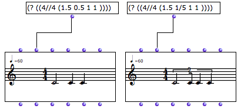
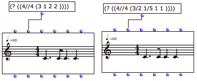
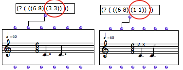

Navigation générale : 

  - [Guide](OM-Documentation.md)
  - [Plan](OM-Documentation_1.md)
  - [Glossaire](OM-Documentation_2.md)

OpenMusic
DocumentationHiérarchie
de section : [OM 6.6 User
Manual](OM-User-Manual.md) \>
[Score
Objects](ScoreObjects.md) \>
[Rhythm Trees](RT.md) \>
Notation : in
Practice

Navigation : [page
précédente](RT1.md "page précédente(Rhythm Trees Structure)")
| [page
suivante](ScorePlayer.md "page suivante(Score Players)")

**Attention**, votre navigateur ne supporte pas le **javascript** ou
celui-ci à été désactivé. Certaines fonctionnalités de ce guide sont
restreintes.

# Notation : in Practice

[Sommaire ](#)

1.  [Proportions](#eeN6)
2.  [Rests, Beams and Ties](#eeNd7)
3.  [Dotted Values](#eeN173)
4.  [Functions of the Rhythm Trees Package](#eeN1cf)

## Proportions

Elementary Proportions Lists

<table>
<colgroup>
<col style="width: 50%" />
<col style="width: 50%" />
</colgroup>
<tbody>
<tr class="odd">
<td>

</td>
<td>

Rhythm trees can also be expressed with simple proportion lists, which ignore the duration and time signature levels. At a basic level, OM always interprets proportions according to two criteria :

<ul>
<li>  = 1</li>
<li>Time signature = 4/4.</li>
</ul>

</td>
</tr>
</tbody>
</table>

This way of writing rhythm trees can lead to very interesting processes
in the manipulation of temporality. A given rhythmic structure can be
modified or read according to various beats patterns, by associating
given proportions to more or less sophisticated functions or programs.

Integers, Ratios and Floats

Proportions can be expressed with integers, floats or ratios.
Nevertheless :

  - A same group cannot take both floats and ratios. 
  - Values between 0 and 1 are not accepted by rhythm trees.
    

In both cases, OM renders an approximation of the rhythm tree.

The MakeTree function

The **mktree** function allows to associate a list of proportions to a
list of time signatures.

  - If a list contains a single time signature, the rhythmic
    pattern is extended as much as required by the duration of the
    tree.
  -  If a list contains several time signatures, each time
    signature is valid for one measure only, so that the rhythm may
    remain incomplete. 

## Rests, Beams and Ties

Rests

<table>
<colgroup>
<col style="width: 50%" />
<col style="width: 50%" />
</colgroup>
<tbody>
<tr class="odd">
<td>

Silences are expressed by negative values.

</td>
<td>

</td>
</tr>
</tbody>
</table>

Beams

<table>
<colgroup>
<col style="width: 50%" />
<col style="width: 50%" />
</colgroup>
<tbody>
<tr class="odd">
<td>

</td>
<td>

Values within a group are beamed automatically.

</td>
</tr>
</tbody>
</table>

Ties

<table>
<colgroup>
<col style="width: 50%" />
<col style="width: 50%" />
</colgroup>
<tbody>
<tr class="odd">
<td>

Add <strong>.0</strong> to create a tie with the previous note.

</td>
<td>

</td>
</tr>
</tbody>
</table>

## Dotted Values

Automatic Notation

Dotted values are "naturally" expressed by relevant proportions, in the
case of "binary" time signatures – n/ 4, n/ 2, n/1 –, or elementary
ternary time signatures – 3/8, 3/16.

Constraints

In other cases – 6/8 and its paradigm –, OM's behaviour doesn't always
apply the conventions of traditional notation. Proportions can be
expressed with different but equivalent rhythmic notations, depending on
the values used in rhythm trees.

  - The quarter note being the default beat value, ternary
    notation is adapted to the use of the quarter note and its
    multiples. In other words, OM privileges the use of tuplets, rather
    than that of dotted values.
  - To get dotted values in a ternary time signature, use
    multiples of 3 to express proportions. 

## Functions of the Rhythm Trees Package

<table>
<colgroup>
<col style="width: 50%" />
<col style="width: 50%" />
</colgroup>
<tbody>
<tr class="odd">
<td>

</td>
<td>

A set of functions dedicated to rhythm tree is available in the <code class="menuPath_tl">Functions / Score / Trees</code> menu. For thorough information about these functions, refer the online documentation.

</td>
</tr>
</tbody>
</table>

Références : 

Plan :

  - [OpenMusic Documentation](OM-Documentation.md)
  - [OM 6.6 User Manual](OM-User-Manual.md)
      - [Introduction](00-Sommaire.md)
      - [System Configuration and
        Installation](Installation.md)
      - [Going Through an OM Session](Goingthrough.md)
      - [The OM Environment](Environment.md)
      - [Visual Programming I](BasicVisualProgramming.md)
      - [Visual Programming
        II](AdvancedVisualProgramming.md)
      - [Basic Tools](BasicObjects.md)
      - [Score Objects](ScoreObjects.md)
          - [Presentation](Score-Objects-Intro.md)
          - [Rhythm Trees](RT.md)
              - [Rhythm Trees Structure](RT1.md)
              - Notation : in
                Practice
          - [Score Players](ScorePlayer.md)
          - [Score Editors](ScoreEditors.md)
          - [Quantification](Quantification.md)
          - [Export / Import](ImportExport.md)
      - [Maquettes](Maquettes.md)
      - [Sheet](Sheet.md)
      - [MIDI](MIDI.md)
      - [Audio](Audio.md)
      - [SDIF](SDIF.md)
      - [Lisp Programming](Lisp.md)
      - [Errors and Problems](errors.md)
  - [OpenMusic QuickStart](QuickStart-Chapters.md)

Navigation : [page
précédente](RT1.md "page précédente(Rhythm Trees Structure)")
| [page
suivante](ScorePlayer.md "page suivante(Score Players)")

[A propos...](OM-Documentation_3.md)(c) Ircam - Centre
Pompidou

