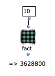

Navigation générale : 

  - [Guide](OM-Documentation.md)
  - [Plan](OM-Documentation_1.md)
  - [Glossaire](OM-Documentation_2.md)

OpenMusic
DocumentationHiérarchie
de section : [OM 6.6 User
Manual](OM-User-Manual.md) \>
[Visual Programming
II](AdvancedVisualProgramming.md) \>
[Abstraction](Abstraction.md)
\> [Recursive
Patches](Recursion.md) \>
Recursion in
OM

Navigation : [page
précédente](Recursion.md "page précédente(Recursive Patches)")
| [page
suivante](RecursiveTree.md "page suivante(Recursive Trees)")

**Attention**, votre navigateur ne supporte pas le **javascript** ou
celui-ci à été désactivé. Certaines fonctionnalités de ce guide sont
restreintes.

# Recursion in OM

## Creating a Recursion

<table>
<colgroup>
<col style="width: 50%" />
<col style="width: 50%" />
</colgroup>
<tbody>
<tr class="odd">
<td>

A recursive program can be designed putting the reference of a blue patch in its own editor – that is, putting a patch within itself .

</td>
<td>

Creating a recursion : a patch is dropped into its own editor.

</td>
</tr>
</tbody>
</table>

<table>
<colgroup>
<col style="width: 50%" />
<col style="width: 50%" />
</colgroup>
<tbody>
<tr class="odd">
<td>

If this patch has inputs and outputs, they will also appear on the patch box, so that the patch can be "called from inside itself".

</td>
<td>

</td>
</tr>
</tbody>
</table>

Infinite Calls / Termination

A **termination condition** is absolutely necessary in a recursive
patch. Otherwise, a succession of infinite calls will be triggered at
the evaluation.

Remind to save all your material before calling a recursive patch.

Internal Patch Recursion

**Do not ever build recursive programs with internal – red – patches, or
with OMLoop boxes.** A function has to be **global** to apply within
itself.

Example: Factorial Patch

<table>
<colgroup>
<col style="width: 50%" />
<col style="width: 50%" />
</colgroup>
<tbody>
<tr class="odd">
<td>

This recursive patch implements a preliminary version of the factorial function. It is called inside itself and calculates fact(n) = n x fact(n-1).

<strong>This function has no termination condition.</strong> If it is called in its current state, it will never end.

</td>
<td>

</td>
</tr>
</tbody>
</table>

<table>
<colgroup>
<col style="width: 50%" />
<col style="width: 50%" />
</colgroup>
<tbody>
<tr class="odd">
<td>

<strong>Termination :</strong>

<ul>
<li> The n values passed recursively are strictly decreasing, since they are each time equal to n-1. </li>
<li>Besides, we know that <strong>fact(1) = 1</strong>.</li>
<li>Therefore, we will add a non recursive branch via omif, applying to cases where n = 1.</li>
</ul>

The resulting patch means : i<strong>f</strong> n = 1, then fact(n) = 1 <strong>else</strong>, fact(n) = n x fact(n-1)

<ol>
<li>
When omif is evaluated, it evaluates the <strong>=</strong> test.
</li>
<li>
The = test returns "nil" if n ≠ 1. I t returns "t" if n = 1. <strong>This is the termination condition of the patch.</strong>
</li>
<li><ul>
<li> omif returns the value of its second input (1), if it gets "t".</li>
<li> omif triggers the evaluation of the boxes that are connected to its third input if n ≠ 1. </li>
<li>The factorial of n is calculated by om-, the fact sub patch and om*. </li>
</ul></li>
</ol>

</td>
<td>

</td>
</tr>
</tbody>
</table>

Using Omif

  - [Conditional Operators](ConditionalOps.md)

Références : 

Plan :

  - [OpenMusic Documentation](OM-Documentation.md)
  - [OM 6.6 User Manual](OM-User-Manual.md)
      - [Introduction](00-Sommaire.md)
      - [System Configuration and
        Installation](Installation.md)
      - [Going Through an OM Session](Goingthrough.md)
      - [The OM Environment](Environment.md)
      - [Visual Programming I](BasicVisualProgramming.md)
      - [Visual Programming
        II](AdvancedVisualProgramming.md)
          - [Abstraction](Abstraction.md)
              - [Abstraction Boxes](AbsBoxes.md)
              - [Application](AbsApplication.md)
              - [Recursive Patches](Recursion.md)
                  - Recursion
                    in OM
                  - [Recursive Trees](RecursiveTree.md)
          - [Evaluation Modes](EvalModes.md)
          - [Higher-Order Functions](HighOrder.md)
          - [Control Structures](Control.md)
          - [Iterations: OMLoop](OMLoop.md)
          - [Instances](Instances.md)
          - [Interface Boxes](InterfaceBoxes.md)
          - [Files](Files.md)
      - [Basic Tools](BasicObjects.md)
      - [Score Objects](ScoreObjects.md)
      - [Maquettes](Maquettes.md)
      - [Sheet](Sheet.md)
      - [MIDI](MIDI.md)
      - [Audio](Audio.md)
      - [SDIF](SDIF.md)
      - [Lisp Programming](Lisp.md)
      - [Errors and Problems](errors.md)
  - [OpenMusic QuickStart](QuickStart-Chapters.md)

Navigation : [page
précédente](Recursion.md "page précédente(Recursive Patches)")
| [page
suivante](RecursiveTree.md "page suivante(Recursive Trees)")

[A propos...](OM-Documentation_3.md)(c) Ircam - Centre
Pompidou

