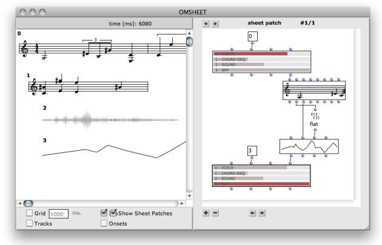
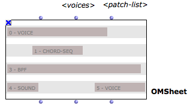

Navigation générale : 

  - [Guide](OM-Documentation.md)
  - [Plan](OM-Documentation_1.md)
  - [Glossaire](OM-Documentation_2.md)

OpenMusic
DocumentationHiérarchie
de section : [OM 6.6 User
Manual](OM-User-Manual.md) \>
Sheet

Navigation : [page
précédente](Intercation2.md "page précédente(Interation (2))")
| [page
suivante](Sheet-Editor.md "page suivante(Sheet Editor)")

**Attention**, votre navigateur ne supporte pas le **javascript** ou
celui-ci à été désactivé. Certaines fonctionnalités de ce guide sont
restreintes.

# Sheet

The **OMSheet** object is a special polyphonic container allowing to
bring together heterogeneous musical objects on its different voices.
The OMSheet editor has specific features ensuring space/time alignments
between the notation and other temporal objects.

Different types of musical objects can be embedded in a sheet  :

  - CHORD-SEQ
  - VOICE
  - SOUND
  - BPF / MIDICONTROL
  - MAQUETTE

The Sheet also allows to process and generate the contents of these
different tracks using visual programs.

Structure

The OMSheet is made of a number of **TRACKS** (). Each track can contain
one or several internal **OBJECTS** localized with a given onset time
and identified in the Sheet by a unique ID number.

An OMSheet has also a number of attached inbuilt patches () allowing to
generate the contents or link the sheet track objects together.

<table>
<colgroup>
<col style="width: 50%" />
<col style="width: 50%" />
</colgroup>
<tbody>
<tr class="odd">
<td>

Find the OMSheet object and tools in the <code class="menuPath_tl">Classes / Score / Sheet</code> menu.

</td>
<td>

</td>
</tr>
</tbody>
</table>

Références : 

Plan :

  - [OpenMusic Documentation](OM-Documentation.md)
  - [OM 6.6 User Manual](OM-User-Manual.md)
      - [Introduction](00-Sommaire.md)
      - [System Configuration and
        Installation](Installation.md)
      - [Going Through an OM Session](Goingthrough.md)
      - [The OM Environment](Environment.md)
      - [Visual Programming I](BasicVisualProgramming.md)
      - [Visual Programming
        II](AdvancedVisualProgramming.md)
      - [Basic Tools](BasicObjects.md)
      - [Score Objects](ScoreObjects.md)
      - [Maquettes](Maquettes.md)
      - Sheet
          - [Sheet Editor](Sheet-Editor.md)
          - [Sheet Box](Sheet-Box.md)
          - [Sheet Patches](Sheet-Patch.md)
      - [MIDI](MIDI.md)
      - [Audio](Audio.md)
      - [SDIF](SDIF.md)
      - [Lisp Programming](Lisp.md)
      - [Errors and Problems](errors.md)
  - [OpenMusic QuickStart](QuickStart-Chapters.md)

Navigation : [page
précédente](Intercation2.md "page précédente(Interation (2))")
| [page
suivante](Sheet-Editor.md "page suivante(Sheet Editor)")

[A propos...](OM-Documentation_3.md)(c) Ircam - Centre
Pompidou

