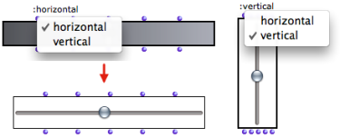

Navigation générale : 

  - [Guide](OM-Documentation.md)
  - [Plan](OM-Documentation_1.md)
  - [Glossaire](OM-Documentation_2.md)

OpenMusic
DocumentationHiérarchie
de section : [OM 6.6 User
Manual](OM-User-Manual.md) \>
[Visual Programming
II](AdvancedVisualProgramming.md) \>
[Interface
Boxes](InterfaceBoxes.md) \>
Slider Box

Navigation : [page
précédente](Button.md "page précédente(Button)")
| [page
suivante](MenuBoxes.md "page suivante(Pop-Up Menu Box)")

**Attention**, votre navigateur ne supporte pas le **javascript** ou
celui-ci à été désactivé. Certaines fonctionnalités de ce guide sont
restreintes.

# Controlling Values : Slider Box

[Sommaire ](#)

1.  [Features](#cdN1e)
2.  [Settings](#cdNa2)
3.  [Using the "Action" Input](#cdN128)
4.  [A Musical Application](#cdN19a)

The **slider** box allows to select a value in a given range with a
slider interface.

## Features

<table>
<colgroup>
<col style="width: 50%" />
<col style="width: 50%" />
</colgroup>
<tbody>
<tr class="odd">
<td>

The slider has five inputs and outputs :

<ol>
<li>
" <strong>direction</strong> " : the slider's vertical or horizontal orientation.
</li>
<li>
" <strong>range</strong> " : the slider's range, from a minimum to a maximum value.
</li>
<li>
" <strong>step</strong> " : the precision of the slider – should be equal to 1.
</li>
<li>
" <strong>value</strong> " : position of the slider.
</li>
<li>
" <strong>action</strong> " : an action to perform specified by a lambda function or patch.
</li>
</ol>

</td>
<td>

</td>
</tr>
</tbody>
</table>

## Settings

Completing the Slider's Setting

To complete the slider's setting :

1.  enter values in the inputs data boxes

2.  evaluate the box

3.  **lock the box afterwards** to avoid resetting the values at
    subsequent evaluations.

"Direction" Input

Note that the slider orientation might not be taken into account if it
is incompatible with the box's size. A horizontal slider can be "resized
vertically".

Slider's Value(s)

The range, step and value inputs can be used to set the slider. The
initial value is modified when the user moves the slider.

The slider's outputs give access to the different properties of the
slider box.

In particular, the **fourth "value" output** returns a slider's
position's current value.

## Using the "Action" Input

The "action" input of the slider can be used for triggering an operation
that will integrate the "value" input, that is, **the slider's
position, ** as a parameter.

<table>
<colgroup>
<col style="width: 50%" />
<col style="width: 50%" />
</colgroup>
<tbody>
<tr class="odd">
<td>

</td>
<td>

The "action" input must be connected to a function or a <a href="LambdaMode.md">box on "lambda" mode</a> with one input or argument.

When the slider is moved, this function is called with the value of the "value" input as argument.

To set or modify the function associated with the slider :

<ol>
<li>
connect the box or function to the fifth input,
</li>
<li>
evaluate the slider box .
</li>
</ol>

</td>
</tr>
</tbody>
</table>

## A Musical Application

  - The "range" input takes midi values from 48 to 72 – C3 to C5.

  - The "step" value is equal to 1, so that each step of the slider
    corresponds to a semi-tone.

  - The "initial value" of the slider is equal to 48, the lowest pitch
    of the range.

  - The patch on "lambda" mode is a very simple program that applies the
    slider's value to the pitch input of the send-midi-note function.

When the slider is moved, the note played by send-midi-note matches the
value of the slider.

Références : 

Plan :

  - [OpenMusic Documentation](OM-Documentation.md)
  - [OM 6.6 User Manual](OM-User-Manual.md)
      - [Introduction](00-Sommaire.md)
      - [System Configuration and
        Installation](Installation.md)
      - [Going Through an OM Session](Goingthrough.md)
      - [The OM Environment](Environment.md)
      - [Visual Programming I](BasicVisualProgramming.md)
      - [Visual Programming
        II](AdvancedVisualProgramming.md)
          - [Abstraction](Abstraction.md)
          - [Evaluation Modes](EvalModes.md)
          - [Higher-Order Functions](HighOrder.md)
          - [Control Structures](Control.md)
          - [Iterations: OMLoop](OMLoop.md)
          - [Instances](Instances.md)
          - [Interface Boxes](InterfaceBoxes.md)
              - [General Features](GeneralFeatures.md)
              - [Text Boxes](TextBoxes.md)
              - [Check Box](CheckBox.md)
              - [List Boxes](ListBoxes.md)
              - [Button](Button.md)
              - Slider
                Box
              - [Pop-Up Menu Box](MenuBoxes.md)
              - [Examples of Use](InterfaceExample.md)
          - [Files](Files.md)
      - [Basic Tools](BasicObjects.md)
      - [Score Objects](ScoreObjects.md)
      - [Maquettes](Maquettes.md)
      - [Sheet](Sheet.md)
      - [MIDI](MIDI.md)
      - [Audio](Audio.md)
      - [SDIF](SDIF.md)
      - [Lisp Programming](Lisp.md)
      - [Errors and Problems](errors.md)
  - [OpenMusic QuickStart](QuickStart-Chapters.md)

Navigation : [page
précédente](Button.md "page précédente(Button)")
| [page
suivante](MenuBoxes.md "page suivante(Pop-Up Menu Box)")

[A propos...](OM-Documentation_3.md)(c) Ircam - Centre
Pompidou

