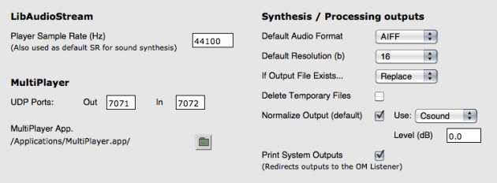

Navigation générale : 

  - [Guide](OM-Documentation.md)
  - [Plan](OM-Documentation_1.md)
  - [Glossaire](OM-Documentation_2.md)

OpenMusic
DocumentationHiérarchie
de section : [OM 6.6 User
Manual](OM-User-Manual.md) \>
[Audio](Audio.md) \>
Audio
Preferences

Navigation : [page
précédente](Externals.md "page précédente(External Libraries)")
| [page suivante](SDIF.md "page suivante(SDIF)")

**Attention**, votre navigateur ne supporte pas le **javascript** ou
celui-ci à été désactivé. Certaines fonctionnalités de ce guide sont
restreintes.

# Audio Preferences

The `Audio` tab in the OM Preferences window gathers a number of options
related to audio features and sound processing in OM.

General Information about OM Preferences

  - [Preferences](Preferences.md)

LibAudioStream Sample Rate

This option determines the sample rate of the default OM player. OM
supports audio file in any sample rate, but the player has one single
rate so playing files in a different sample rate may produce
accelerations or slowdowns.

Some synthesis functions in [External sound processing
libraies](Externals.md) (e.g. OMChroma) use this parameter to
determine the default sound synthesis output sample rate (when not given
explicitely in the synthesis parameters).

About the Audio Player

  - [The Audio Player](AudioPlayer.md)

MultiPlayer Options

This part allows to set up the path and default OSC options for an
alternative audio Player.

More about the MultiPlayer and Options

  - [The Audio Player](AudioPlayer.md)

Default Audio Format

This option allows to choose between AIFF and WAV for the default output
format of sound synthesis or processing functions.

This parameter is used by the
[SAVE-SOUND](SoundProcessing.md) function and by some
[External sound processing libraies](Externals.md).

Default Resolution

This options allows to choose a default resolution for the output of
sound synthesis or processing functions. Standard accepted standard
values are 8, 16 or 24 bits. Some software also accept 32 bits.

This parameter is used by some [External sound processing
libraies](Externals.md) (e.g. OM2Csound, OM-SuperVP, OM-Chant,
OMChroma...)

If Output File Exists...

This options allows OM to determine what to do when some file to be
created by a sound analysis/synthesis process (a sound file, but also
possibly an SDIF file for sound analyses, or other temporary files).

The two available possibilities are

  -  **Replace **: the new file deletes and replace the existing
    one
  -  **Auto-rename** : the new file is given a new name in order
    to preserve the existing one (new name is basically of the form N ,
    where N is a number assigned automatically.

Delete Temporary Files

During sound processes, temporary files are often created to store
parameters, intermediary data, etc. With this option you can choose
whether the temporary files should be deleted after the process is done
or not. Keeping temporary file may allow to debug these process but may
also saturate your disk space with unnecessary files.

**Note :** files are considered "temporary" when they do not appear in
the OM patches. If, for instance, you use an SDIF or text file as input
or intermediary data explicitely specified in your patch, this file
should not be trashed at the end of your process.

Normalize Output

Some sound processing and synthesis utilities from the [External
sound processing libraies](Externals.md) propose to normalize the
resulting output.

This option allows to set the default behaviour in this case, and to
specify the default normalization level (used if no information is given
explicitely in the patch).

Note that OM does not perform normlization by itself, so the contents of
the normalization menu is empty (and the option disabled) by default.
Normalisers are loaded with external libraries (e.g. OM2Csound or
OM-SuperVP).

Print System Outputs

Thsi option allows to redirect the standard output of the external sound
analysis/synthesis processes to the OM Listener.

This option is extremely useful in order to debug these process (see
error messages) and understand problems. When output prints are
important, however, this can significanltly slow down the evaluation.

Références : 

Plan :

  - [OpenMusic Documentation](OM-Documentation.md)
  - [OM 6.6 User Manual](OM-User-Manual.md)
      - [Introduction](00-Sommaire.md)
      - [System Configuration and
        Installation](Installation.md)
      - [Going Through an OM Session](Goingthrough.md)
      - [The OM Environment](Environment.md)
      - [Visual Programming I](BasicVisualProgramming.md)
      - [Visual Programming
        II](AdvancedVisualProgramming.md)
      - [Basic Tools](BasicObjects.md)
      - [Score Objects](ScoreObjects.md)
      - [Maquettes](Maquettes.md)
      - [Sheet](Sheet.md)
      - [MIDI](MIDI.md)
      - [Audio](Audio.md)
          - [Sound Object](Sound.md)
          - [Sound Editor](SoundEditor.md)
          - [Audio Player](AudioPlayer.md)
          - [Sound Tools](SoundTools.md)
          - [Sound Processing](SoundProcessing.md)
          - [Recording](SoundRecording.md)
          - [External Libraries](Externals.md)
          - Audio
            Preferences
      - [SDIF](SDIF.md)
      - [Lisp Programming](Lisp.md)
      - [Errors and Problems](errors.md)
  - [OpenMusic QuickStart](QuickStart-Chapters.md)

Navigation : [page
précédente](Externals.md "page précédente(External Libraries)")
| [page suivante](SDIF.md "page suivante(SDIF)")

[A propos...](OM-Documentation_3.md)(c) Ircam - Centre
Pompidou

