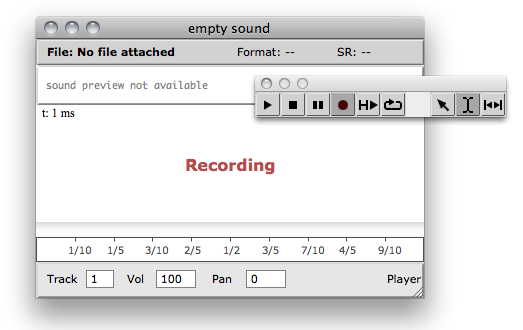

Navigation générale : 

  - [Guide](OM-Documentation.md)
  - [Plan](OM-Documentation_1.md)
  - [Glossaire](OM-Documentation_2.md)

OpenMusic
DocumentationHiérarchie
de section : [OM 6.6 User
Manual](OM-User-Manual.md) \>
[Audio](Audio.md) \>
Recording

Navigation : [page
précédente](SoundProcessing.md "page précédente(Sound Processing)")
| [page
suivante](Externals.md "page suivante(External Libraries)")

**Attention**, votre navigateur ne supporte pas le **javascript** ou
celui-ci à été désactivé. Certaines fonctionnalités de ce guide sont
restreintes.

# Recording

OM offers basic functionalities for recording audio input into sound
files.

Only stereo recording is currently supported.

## Recording Audio in a Patch

The **RECORD-SOUND** box allows to write the system audio input in a
file and returns the path to this file.

First argument specifies a duration of audio recording. Evaluation will
therefore be "freezed" during this time, before to return the created
sound file.

## Recording Audio in the Sound Editor

Use the RECORD button

in the sound editor in order to record a new sound.

At pressing RECORD, a dialog will allow to choose a location and name
for the new sound file.

Press the STOP button of the palette to stop recording. The recorded
sound will replace the previous sound in the editor and associated SOUND
box.

More about the Sound Editor

  - [The Sound Editor](SoundEditor.md)

Stereo recording

Note that recorded audio files are always stereo.

External tools exist (ex. in the OM-SuperVP library) to split
multichannel audio tracks.

Références : 

Plan :

  - [OpenMusic Documentation](OM-Documentation.md)
  - [OM 6.6 User Manual](OM-User-Manual.md)
      - [Introduction](00-Sommaire.md)
      - [System Configuration and
        Installation](Installation.md)
      - [Going Through an OM Session](Goingthrough.md)
      - [The OM Environment](Environment.md)
      - [Visual Programming I](BasicVisualProgramming.md)
      - [Visual Programming
        II](AdvancedVisualProgramming.md)
      - [Basic Tools](BasicObjects.md)
      - [Score Objects](ScoreObjects.md)
      - [Maquettes](Maquettes.md)
      - [Sheet](Sheet.md)
      - [MIDI](MIDI.md)
      - [Audio](Audio.md)
          - [Sound Object](Sound.md)
          - [Sound Editor](SoundEditor.md)
          - [Audio Player](AudioPlayer.md)
          - [Sound Tools](SoundTools.md)
          - [Sound Processing](SoundProcessing.md)
          - Recording
          - [External Libraries](Externals.md)
          - [Audio Preferences](SoundPreferences.md)
      - [SDIF](SDIF.md)
      - [Lisp Programming](Lisp.md)
      - [Errors and Problems](errors.md)
  - [OpenMusic QuickStart](QuickStart-Chapters.md)

Navigation : [page
précédente](SoundProcessing.md "page précédente(Sound Processing)")
| [page
suivante](Externals.md "page suivante(External Libraries)")

[A propos...](OM-Documentation_3.md)(c) Ircam - Centre
Pompidou

