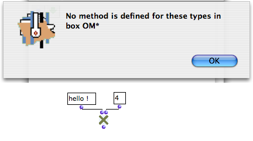

Navigation générale : 

  - [Guide](OM-Documentation.md)
  - [Plan](OM-Documentation_1.md)
  - [Glossaire](OM-Documentation_2.md)

OpenMusic
DocumentationHiérarchie
de section : [OM 6.6 User
Manual](OM-User-Manual.md) \>
Errors and
Problems

Navigation : [page
précédente](LispForOM.md "page précédente(Writing Code for OM)")
| [page
suivante](QuickStart-Chapters.md "page suivante(OpenMusic QuickStart)")

**Attention**, votre navigateur ne supporte pas le **javascript** ou
celui-ci à été désactivé. Certaines fonctionnalités de ce guide sont
restreintes.

# Errors and Problems

## Warnings

Listener Messages

<table>
<colgroup>
<col style="width: 50%" />
<col style="width: 50%" />
</colgroup>
<tbody>
<tr class="odd">
<td>

</td>
<td>

Minor programming errors are usually displayed in the Listener window as well as plain messages. This allows OM to keep on running smoothly and the user to understand the origins of the error.

Such error messages can occur when evaluating a box, for instance.

</td>
</tr>
</tbody>
</table>

Handle Error Messages Option

More "serious" errors can interrupt the evaluation of a patch. If the
`handle error messages` option was selected in the `Preferences` pane,
an error window opens.

If not, the error will propagate and a **Terminal** window will open.

## The Lisp Terminal

In the case of more important, unpredicted errors, or if the `handle
error messages` option wasn't selected, a system Terminal opens and
reprorts the error.

Terminal Window Commands

This terminal window is an underlying Lisp debugger, which can be
exited, or used for understanding and possibly solve the cause of an
error.

Here are a few useful commands to enter in this terminal :

  - To get back to the **preceding step** of the error : enter
    ":top" and validate
  - To display the **simple backtrace** of an error : enter ":b"
    and validate.
  - To display the **detailed backtrace** of an error : enter
    ":bb" and validate.

The function call stack in question can be copied and submitted in a bug
report to the IRCAM development or support teams.

  - To use one of the **options offered** by the Terminal, type
    ":c" with the option's reference, e.g. : ":c 1", ":c 2", etc. and
    validate.
  - To display **other possible commands** , enter ":help" and
    validate.

An error in the Mac OS system Terminal

## Abort Command

If a program execution is stuck or lasts too long, go to the OM Listener
and type `Cmd` + `SHIFT` + `a` to abort.

Références : 

Plan :

  - [OpenMusic Documentation](OM-Documentation.md)
  - [OM 6.6 User Manual](OM-User-Manual.md)
      - [Introduction](00-Sommaire.md)
      - [System Configuration and
        Installation](Installation.md)
      - [Going Through an OM Session](Goingthrough.md)
      - [The OM Environment](Environment.md)
      - [Visual Programming I](BasicVisualProgramming.md)
      - [Visual Programming
        II](AdvancedVisualProgramming.md)
      - [Basic Tools](BasicObjects.md)
      - [Score Objects](ScoreObjects.md)
      - [Maquettes](Maquettes.md)
      - [Sheet](Sheet.md)
      - [MIDI](MIDI.md)
      - [Audio](Audio.md)
      - [SDIF](SDIF.md)
      - [Lisp Programming](Lisp.md)
      - Errors and
        Problems
  - [OpenMusic QuickStart](QuickStart-Chapters.md)

Navigation : [page
précédente](LispForOM.md "page précédente(Writing Code for OM)")
| [page
suivante](QuickStart-Chapters.md "page suivante(OpenMusic QuickStart)")

[A propos...](OM-Documentation_3.md)(c) Ircam - Centre
Pompidou

